# Основы компьютерных сетей, экзаменационная сессия 2023/2024

## Теоретические вопросы

1. [✅ Понятие компьютерной сети](#1-понятие-компьютерной-сети)

2. [✅ Классификация компьютерных сетей](#2-классификация-компьютерных-сетей)

3. [✅ Стандарты компьютерных сетей](#3-стандарты-компьютерных-сетей)

4. [✅ Наиболее распространенные модели компьютерных сетей](#4-наиболее-распространенные-модели-компьютерных-сетей)

5. [✅ Физический уровень модели OSI](#5-физический-уровень-модели-osi)

6. [✅ Канальный уровень модели OSI](#6-канальный-уровень-модели-osi)

7. [✅ Сетевой уровень модели OSI](#7-сетевой-уровень-модели-osi)

8. [✅ Транспортный и сеансовый уровни модели OSI](#8-транспортный-и-сеансовый-уровни-модели-osi)

9. [✅ Прикладной уровень и уровень представления модели OSI](#9-прикладной-уровень-и-уровень-представления-модели-osi)

10. [✅ Семейство протоколов TCP/IP](#10-семейство-протоколов-tcpip)

11. [✅ Эволюция COM-портов и их место в современных ПК](#11-эволюция-com-портов-и-их-место-в-современных-пк)

12. [✅ Структура COM-портов ПК](#12-структура-com-портов-пк)

13. [✅ Цепи RS-232 и их использование](#13-цепи-rc-232-и-их-использование)

14. [✅ Асинхронный режим работы COM-порта](#14-асинхронный-режим-работы-com-порта)

15. [✅ Синхронный режим работы COM-порта](#15-синхронный-режим-работы-com-порта)

16. [✅ Тактирование COM-порта](#16-тактирование-com-порта)

17. [✅ Архитектура COM-портов ПК](#17-архитектура-com-портов-пк)

18. [✅ Стандарты, близкие к RS-232](#18-стандарты-близкие-к-rs-232)

19. [✅ Структура типового пакета компьютерной сети](#19-структура-типового-пакета-компьютерной-сети)

20. [✅ Инкапсуляция и ее проявления в компьютерных сетях](#20-21a-причина-применения-стаффинга)

21. [✅ Бит-стаффинг](#21-бит-стаффинг)

22. [✅ Байт-стаффинг](#22-байт-стаффинг)

23. [✅ Особенности линейного кодирования и классификация линейных кодов, применяемых в компьютерных сетях](#23-особенности-линейного-кодирования-и-классификация-линейных-кодов-применяемых-в-компьютерных-сетях)

24. [✅ Линейные коды без возврата к нулю и с возвратом к нулю](#24-линейные-коды-без-возврата-к-нулю-и-с-возвратом-к-нулю)

25. [✅ Манчестерские и многоуровневые линейные коды](#25-манчестерские-и-многоуровневые-линейные-коды)

26. [✅ Блочные линейные коды](#26-блочные-линейные-коды)

27. [✅ Поля Галуа и их применение в компьютерных сетях](#27-поля-галуа-и-их-применение-в-компьютерных-сетях)

28. [✅ Модель помехоустойчивого канала связи и теорема Шеннона](#28-модель-помехоустойчивого-канала-связи-и-теорема-шеннона)

29. [✅ Линейные помехоустойчивые коды, включая коды Хэмминга и циклические коды](#29-линейные-помехоустойчивые-коды-включая-коды-хэмминга-и-циклические-коды)

30. [✅ Классификация помехоустойчивых кодов](#30-классификация-помехоустойчивых-кодов)

31. [✅ Классификация каналов в сети передачи данных](#31-классификация-каналов-в-сети-передачи-данных)

32. [✅ Логические и физические топологии LAN](#32-33а-типы-и-виды-топологий-сетей)

33. [✅ Логические и физические топологии WAN и RAS](#33-логические-и-физические-топологии-wan-и-ras)

34. [✅ Особенности случайных методов доступа к моноканалу](#34-особенности-случайных-методов-доступа-к-моноканалу)

35. [✅ CSMA/CD (Ethernet)](#35-csmacd-ethernet)

36. [✅ Кадр Ethernet](#36-кадр-ethernet)

37. [✅ CSMA/CA (Wi-Fi)](#37-csmaca-wi-fi)

38. [✅ Кадры Wi-Fi](#38-кадры-wi-fi)

39. [✅ Особенности детерминированных методов доступа к моноканалу](#39-особенности-детерминированных-методов-доступа-к-моноканалу)

40. [✅ Алгоритм Token Ring](#40-алгоритм-token-ring)

41. [✅ Реализации детерминированных методов доступа к моноканалу](#41-реализации-детерминированных-методов-доступа-к-моноканалу)

42. [✅ Адресация в компьютерных сетях и классификация адресов](#42-адресация-в-компьютерных-сетях-и-классификация-адресов)

43. [✅ MAC-адреса](#43-mac-адреса)

44. [✅ Заголовок IPv4](#44-заголовок-ipv4)

45. [✅ Заголовок IPv6](#45-заголовок-ipv6)

46. [✅ Протокол ARP](#46-протокол-arp)

47. [✅ Структура системы DNS](#47-структура-системы-dns)

48. [✅ Сообщения DNS](#48-сообщения-dns)

49. [✅ Виртуальные соединения в сети передачи данных](#49-виртуальные-соединения-в-сети-передачи-данных)

50. [✅ Классификация оконных механизмов, используемых в сети передачи данных](#50-классификация-оконных-механизмов-используемых-в-сети-передачи-данных)

51. [✅ Структура системы TCP](#51-структура-системы-tcp)

52. [✅ Заголовок TCP](#52-заголовок-tcp)

53. [✅ Протокол TCP](#53-протокол-tcp)

54. [✅ Усовершенствования протокола TCP](#54-усовершенствования-протокола-tcp)

55. [✅ Протокол UDP и заголовок UDP](#55-протокол-udp-и-заголовок-udp)

56. [✅ Классификация и характеристики сред передачи данных](#56-классификация-и-характеристики-сред-передачи-данных)

57. [✅ Среды передачи данных на основе коаксиальных кабелей](#57-среды-передачи-данных-на-основе-коаксиальных-кабелей)

58. [✅ Среды передачи данных на основе витых пар](#58-среды-передачи-данных-на-основе-витой-пары)

59. [✅ Среды передачи данных на основе оптоволоконных кабелей](#59-среды-передачи-данных-на-основе-оптоволоконных-кабелей)

60. [✅ Физический уровень Ethernet](#60-физический-уровень-ethernet)

61. [✅ Структурированные кабельные системы и их модели](#61-структурированные-кабельные-системы-и-их-модели)

62. [✅ Питание и заземление в структурированных кабельных системах](#62-питание-и-заземление-в-структурированных-кабельных-системах)

63. [✅ Пожарная безопасность структурированных кабельных систем](#63-пожарная-безопасность-структурированных-кабельных-систем)

64. [✅ Технология PoE](#64-технология-poe)

65. [*️⃣ Структура системы FTP](#65-структура-системы-ftp)

66. [*️⃣ Протокол FTP и режимы обмена по протоколу FTP](#66-протокол-ftp-и-режимы-обмена-по-протоколу-ftp)

67. *️⃣ Структура и особенности системы Telnet

68. *️⃣ Электронные письма и почтовые ящики

69. *️⃣ Обобщенная структура системы электронной почты

70. *️⃣ Почтовые агенты

71. *️⃣ Протокол SMTP и его расширения

72. *️⃣ Протокол POP3 и его расширения

73. *️⃣ Протокол IMAP и его расширения

74. *️⃣ Структура системы HTTP

75. *️⃣ Ресурсы в системе HTTP

76. *️⃣ Заголовки HTTP

77. *️⃣ Методы HTTP

78. *️⃣ Специализированные компьютерные сети для передачи файлов и сообщений

## Практические вопросы

1. ✅ [Инкапсуляция, туннелирование и фрагментация в компьютерных сетях (примеры)](#1-инкапсуляция-туннелирование-и-фрагментация-в-компьютерных-сетях-примеры)

2. [✅ Алгоритмы бит-стаффинга и байт-стаффинга (схемы и алгоритмы)](#2-алгоритмы-бит-стаффинга-и-байт-стаффинга-схемы-и-алгоритмы)

3. [✅ Линейные коды (кодирование)](#3-линейные-коды-кодирование)

4. [✅ Помехоустойчивые коды (расчеты)](#4-помехоустойчивые-коды-расчеты)

5. [✅ Код Хэмминга и циклический код (кодирование)](#5-код-хэмминга-и-циклический-код-кодирование)

6. [✅ Поля Галуа (математические операции)](#6-поля-галуа-математические-операции)

7. [✅ Адресация в компьютерных сетях (примеры)](#7-адресация-в-компьютерных-сетях-примеры)

8. [✅ TCP (диаграммы и взаимодействия с детализацией до SYN, ACK, FIN, SN, AN, W и Data)](#8-tcp-диаграммы-и-взаимодействия-с-детализацией-до-syn-ack-fin-sn-an-w-и-data-slow-start-1-сегмента-потеря-сегмента)

9. [✅ СКС (структурные схемы)](#9-скс-структурные-схемы)

10. *️⃣ FTP (примеры взаимодействия с детализацией до команд и ответов)

11. *️⃣ SMTP (примеры взаимодействия с детализацией до команд и ответов)

12. *️⃣ POP3 (примеры взаимодействия с детализацией до команд и ответов)

13. *️⃣ IMAP (примеры взаимодействия с детализацией до команд и ответов)

14. *️⃣ HTTP (примеры взаимодействия с детализацией до команд и ответов)

---

# 1. Понятие компьютерной сети

Под _компьютерной сетью_ понимают совокупность различных технических средств (компьютеров и другого оборудования), предназначенная для передачи информации на относительно большие расстояния (за пределы компьютеров).

В основе КС лежит _сеть передачи данных (СПД, Data Communication Network)_, которая может задействовать различные _среды передачи данных (СрПД, Media)_.

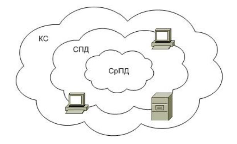

Группы устройств в СПД:
- Оконечные (End devices) - находятся по периметру;
- Посредники (Intermediary devices) - составляют ядро.

Типы трафика в СПД:
- Обычные компьютерные данные (Data);
- Голос (Voice);
- Видео (Video).

Особенности трафика обеспечиваются _качеством обслуживания - Quality of Service (QoS)_.

Традиционные виды компьютерных данных, по умолчанию, обслуживаются по принципу _Best Efforts_, что, по сути, является отсутствием QoS.

В рамках предоставляемой оборудованием СПД _полосы пропускания (bandwidth)_ можно выделить реально задействованную её часть (_throughput_) и полезную составляющую этой задействованной части (_goodput_) - без учета служебного трафика.

# 2. Классификация компьютерных сетей

В зависимости от охватываемой территории:
- Local Area Networks (LANs) - локальные КС;
- Wide Area Networks (WANs) - глобальные КС;
- Metropolitan Area Networks (MANs) - городские КС;
- Personal Area Networks (PANs) - личные КС;

а также специфические:
- Remote Access Services (RASes) - КС подключения удаленных пользователей;
- Data Center Networks (DCNes) - КС центров обработки данных;
- Home Networks - домашние КС;
- Industrial Networks - промышленные КС.

В зависимости от открытости:
- Intranets - КС внутреннего доступа;
- Internets - КС внешнего доступа.

Кроме того, сети могут быть:
- Изолированными;
- Открытыми для прослушивания.

С точки зрения организации взаимодействия:
- Сильносвязанными (хост <-> терминал);
- Слабосвязанными (клиент <-> сервер).

## 2.A Типы оборудования в КС

С точки зрения общей организации работы сетевых устройств принято выделять:
- Оконечное оборудование данных (ООД, Data Terminal Equipment);
- Аппаратуру передачи данных (АПД, Data Communication Equipment или Data Circuit-terminating Equipment).

ООД находится на границе СПД и «концентрирует» данные (создает и потребляет передаваемые информационные потоки).

АПД находится в пределах СПД и «транслирует» данные (позволяет передавать и принимать информационные потоки).

Разница заключается в том, что первоистоником синхронизации обычно является АПД.

Понятия ООД и АПД отлично соотносятся с понятиями _оконечных устройств_ и _устройств-посредников_, однако, поскольку термины ООД и АПД связаны с определенными технологиями, знаки равенства ставить некорректно.

# 3. Стандарты компьютерных сетей

Существуют следующие основные стандарты:
- Международные (например, ISO/IEC);
- Европейские (например, EN);
- Американские (например, ANSI/TIA/EIA).

Стандарты могут иметь _предварительный (preliminary)_ или _временный (interim)_ характер, могут включать _дополнения (annexes)_, а также устаревать или замещаться другими стандартами _(obsolete)_.

Воплощением стандарта является его _реализация (implementation)_, которая проверяется на соответствие стандарту посредством _сертификации (certification)_.

В 1980 году при IEEE был создан специальный комитет по стандартизации КС, результатом работы которого стало множество стандартов 802.x.

Наиболее известны следующие стандарты комитета:
- 802.3 - Ethernet;
- 802.11 - WiFi;
- 802.16 - WiMax.

## 3.A Группы стандарта Ethernet

Стандарт Ethernet делят по пропускной способности на три группы:
- Ethernet - до 10 Mbitps;
- Fast Ethernet - 100 Mbitps;
- Gigabit Ethernet - 1, 10, 100, 40, 25 Gbitps.

# 4. Наиболее распространенные модели компьютерных сетей

На сегодняшний день наиболее распространенными моделями компьютерных сетей являются OSI и TCP/IP.

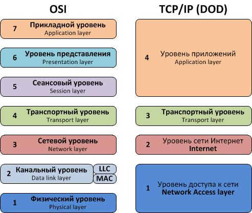

## 4.1. Open System Interconnection (OSI/ISO)

OSI состоит из 7 уровней:
- физического;
- канального;
- сетевого;
- транспортного;
- сессионного;
- прикладного.

Взаимодействие в рамках OSI:
- Интерфейс (вертикальное) – правила взаимодействия между соседними уровнями в иерархии;
- Протокол (горизонтальное) – правила взаимодействия разных устройств на одном уровне иерархии.

## 4.2. TCP/IP

TCP/IP состоит из 4 уровней: канальный, межсетевой, транспортный и прикладной.

## 4.3 Cisco Hierarchical Network Model

Компания Cisco на основе многолетнего опыта проектирования сетей разработала собственную иерархическую сетевую модель, которую рекомендует использовать в _корпоративных сетях (enterprise networks)_ разного масштаба.

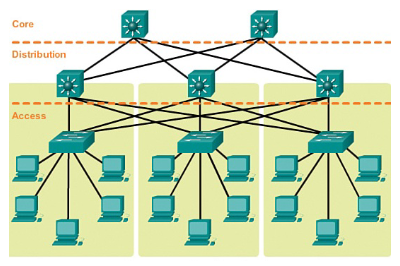.

Модель включает три уровня:
- Access - доступ;
- Distribution - распределение;
- Core - ядро.

Уровень доступа предназначен для обеспечения подключений к КС оконечных пользователей.

Уровень распределения предназначен для обеспечения взимодействия в пределах групп пользователей.

Уровень ядра предназначен для обеспечения высокоскоростной связи между относительно удаленными группами пользователей.

# 5. Физический уровень модели OSI

На физическом уровне формализуют подключение того или иного сетевого устройства к СрПД.

Вводит понятия:
- среды (эфира);
- разъема/физического порта;
- несущей (частоты);
- модуляции;
- сигнала.

Примеры: RS-232, WiFi.

## 5.A Определение понятий

_Несущая (carrier)_ - это сигнал, один или несколько параметров которого изменяются в процессе модуляции.

_Модуляция_ - это процесс изменения одного или нескольких параметров модулируемого несущего сигнала при помощи модулирующего сигнала. 

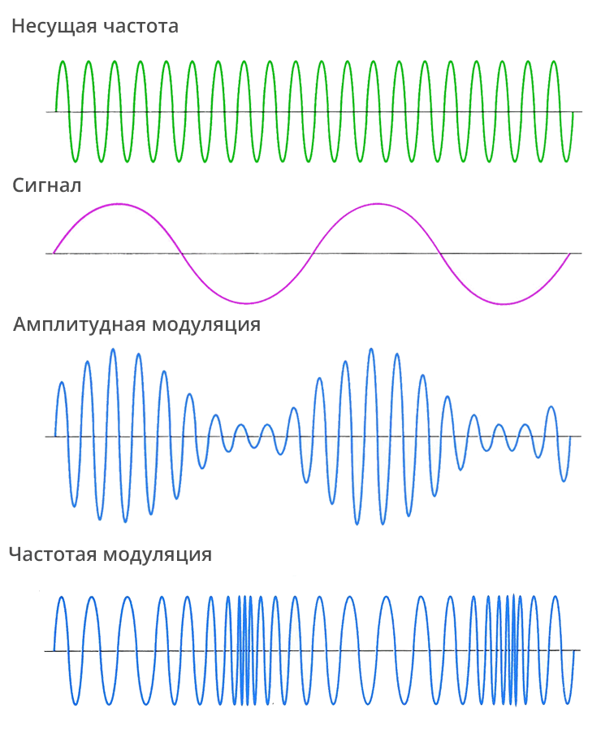

Базовые способы аналоговой модуляции:
- аплитудная модуляция;
- частотная модуляция;
- фазовая модуляция.

## 5.B Симметричные и несимметричные цепи

Симметричные цепи – это особый класс электрических цепей, в которых соблюдаются определенные условия симметрии. В симметричных цепях, параметры и элементы цепи симметрично расположены относительно некоторой оси или плоскости.

Симметричные линии передачи используются для передачи сигналов или электрической энергии на большие расстояния. Они состоят из двух проводников, расположенных параллельно и имеющих одинаковую структуру и параметры. Благодаря симметрии таких линий, сигналы могут быть переданы без искажений и потерь.

# 6. Канальный уровень модели OSI

На канальном уровне формализуют взаимодействие станций в пределах сегмента.

Канальный уровень устроен достаточно сложно, поэтому его разделяют на два подуровня:
1. MAC (Media Access Control) -- контроль доступа к СрПД.
2. LLC (Logical Link Control) -- контроль логического соединения.

Вводит понятия:
- станции;
- сегмента сети;
- физической и логической топологии сегмента сети;
- пакета (кадра);
- бит- и байт-стаффинга;
- адресации в пределах сегмента;
- канального кода;
- кода проверки целостности пакета (кадра);
- алгоритма доступа к моноканалу.

Примеры: Ethernet.

# 7. Сетевой уровень модели OSI

На сетевом уровне формализуют построение полноценной КС произвольного масштаба (из произвольного числа сегментов).

Вводит понятия:
- пакета;
- адресации в пределах КС;
- маршрутизации.

Примеры: IPv4, IPv6.

# 8. Транспортный и сеансовый уровни модели OSI

## 8.1. Транспортный уровень

На транспортном уровне формализуют использование программным обеспечением сетевого оборудования (предоставляение «транспорта» отдельно взятой программе).

Вводит понятия:
- пакета (сегмента сообщения);
- программного порта;
- логического соединения;
- надежности доставки;
- алгоритма борьбы с заторами в СПД.

Примеры: TCP, UDP.

## 8.2. Сеансовый уровень

Сеансовый или сессионный уровень позволяет предоставить доступ к транспорту всем программам в многозадачном окружении.

Вводит понятия:
- программного порта;
- алгоритма мультиплексирования программ.

В практических реализациях сеансовый уровень выражен слабо и обычно его совмещают с транспортным.

Примеры: SMPP (SMS-сообщения), PAP.

# 9. Прикладной уровень и уровень представления модели OSI

## 9.1. Прикладной уровень

Прикладной уровень призван решать конкретные пользовательские задачи с помощью КС.

Примеры: HTTP, SSH, FTP, POP3, SMTP, WebSocket.

## 9.2. Уровень представления

Уровень представления позволяет адаптировать прикладную информацию в форму, приемлемую для передачи по КС, т.е. является прослойкой между программой и «транспортом». 

Основными задачами уровня представления являются:
- кодирование информации с целью обеспечения ее правильной интерпретации;
- шифрование информации с целью обеспечения ее защиты при
пересылке по открытым для прослушивания сетям.

Поскольку обычно уровень представления «привязан» к прикладному
уровню, в реализациях эти уровни часто совмещают.

Примеры: ASCII, EBCDIC, Gzip.

# 10. Семейство протоколов TCP/IP

Исторически сложились два основных семейства протоколов:
1. TCP/IP;
2. IPX/SPX.

Internet базируется на стеке протоколов TCP/IP. 

Хоть в названии модели TCP/IP и указаны 2 конкретных протокола, но ими двумя семейство не ограничивается.

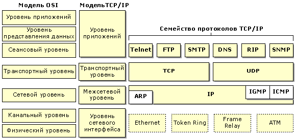

# 11. Эволюция COM-портов и их место в современных ПК

_Universal Asynchronous Receiver/Transmitter_.

В 70-х годах инженеры Intel разработали контроллеры последовательных портов: **8250(UART)** и **8251(USART)**. Подключались по шине X-Bus, в последствии ISA.

Позже был разработан **16550**, ставший стандартом в индустрии. Среди нововведений можно отметить повышенную пропускную способность и возможность буферизации.

Позже контроллеры стали размещать на мультикартах _(Multi I/O)_, подключаемых к ПК по ISA. В последствии Multi I/O стали интегрировать в материнскую плату, а во времена _Pentium_ контроллеры **16550** стали частью _Super I/O_.

Сегодня на материнских платах нет встроенных контроллеров COM-портов, они устарели и заменены USB, однако всё ещё выпускаются соответствующие мультикарты, подключаемые по PCI.

# 12. Структура COM-портов ПК

UART 16550 сочетает в себе функции как приемника так и передатчика. 
В соответствии со стандартом RS-232 есть возможность коммуникации по двунаправленному физическому каналу связи.
На аппаратном уровне приемник и передатчик работают параллельно, т.е. по отдельным физическим цепям, полностью независимо друг от друга. 

Для физического подключения по стандарту RS-232 используют девятиконтактные разъемы DE-9/DB-9. 

Передатчик и приемник COM-порта представляют из себя сдвиговые регистры: данные, предварительно записанные в регистр передатчика параллельно, последовательно сдвигаются в линию под воздействием тактовых импульсов.

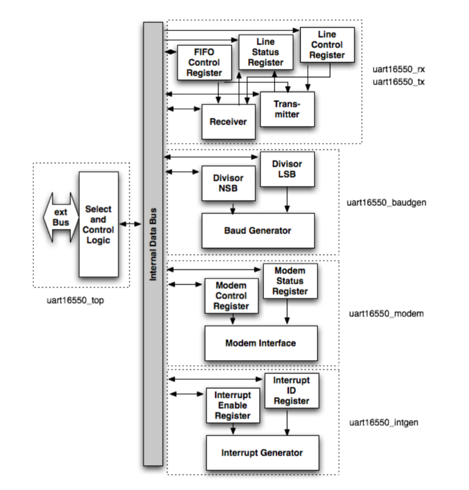

# 13. Цепи RC-232 и их использование

Традиционное назначение цифровых цепей RS-232:
- SOUT (Serial Output) – выход передатчика;
- SIN (Serial Input) – вход приемника;
- RTS (Request to Send) – запрос о передаче от UART к модему;
- CTS (Clear to Send) – подтверждение от модема к UART о готовности;
- DSR (Data Set Ready) – сигнал от модема к UART о готовности к взаимодействию;
- DTR (Data Terminal Ready) – сигнал от UART к модему о готовности к взаимодействию;
- DCD (Data Carrier Detect) – сигнал от модема к UART об обнаружении данных;
- RI (Ring Indicator) – сигнал от модема к UART об обнаружении входящего звонка.

Служебные цепи RS-232 позволяют организовать _контроль
информационного потока (flow control)_.

Основные методы контроля:
- RTS/CTS – полуаппаратный;
- XON/XOFF – программный (по линии передаются специальные байты, обозначающие начало и конец передачи данных).

Использование пары RTS/CTS позволяет контролировать передачу только в одном направлении - от UART к модему, для контроля передачи в обратном направлении используется пара DSR/DTR.

В большинстве современных реализаций контроль по прежнему
предполагает наличие обратной связи, но осуществляется только
приемником.

UART контролирует передачу данных «к себе» управляя активностью
цепи RTS, модем - CTS.

Значительно реже применяют метод DTR/DSR - полностью аналогичен методу RTS/CTS, но значения сигналов сохраняются на протяжении всего информационного обмена, а не каждой посылки.

При полностью программном контроле, приемник передает в обратном
направлении специальный байт XON для инициирования передачи и специальный байт XOFF для остановки передачи.

Подключение:
- АПД к ООД - прямой кабель;
- ООД к ООД - нуль-модемный кабель.

_Примечание: АПД - аппаратура передачи данных, ООД - оконечное оборудование данных._

# 14. Асинхронный режим работы COM-порта

Атомарная единица - байт.

При асинхронном режиме синхронизируется посылка каждого информационного байта.

По умолчанию линия находится в состоянии логической единицы, перед передачей линия выставляется в логический ноль (старт-бит), а после переходит в исходное состояние путем передачи стоп-бита (может быть один, полтора либо два).

Для проверки целостности информационной части, если эта проверка
включена, за информационной частью вставляется бит паритета.

Ошибки отслеживаются приемником.

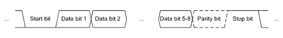

# 15. Синхронный режим работы COM-порта

При синхронном режиме синхронизируется весь информационный поток. 

При простое линия заполняется специальными байтами синхронизации, все поступаемые байты передаются без обрамления.

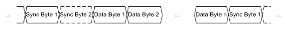

Как и в асинхронном режиме, ошибки отслеживаются приемником. 

При обнаружении ошибок (при длительной непрерывной передаче из-за накапливающихся фазовых сдвигов они неизбежно возникают), приемник должен каким-либо дополнительным способом (так как текущую цепь задействовать невозможно) приостановить передатчик, чтобы тот вновь «заполнил» линию байтами синхронизации.

# 16. Тактирование COM-порта

Тактирование сдвиговых регистров **UART 16550** осуществляется с помощью встроенного программируемого бод-генератора. 

Бод-генератор представляет из себя программируемый делитель частоты. 

Выходная частота рассчитывается по формуле:
```math
F_{out} = F_{in} \div (16 \times DL)
```
где 
- $F_{in}$ - входная частота,
- $DL$ - шестнадцатибитная константа, старшая и младшая части которой хранятся в двух регистрах **UART** (**DLL** и **DLM**).

Пропускную способность последовательных каналов связи принято
оценивать в бодах.

Один бод равен одному сигналу в секунду (для **COM**-порта совпадает с бит/с).

# 17. Архитектура COM-портов ПК

Как и любое устройство ввода-вывода, **UART 16550** содержит регистры управления, регистры состояния, а также информационные регистры.

В стандартной архитектуре ПК для **COM1** и **COM2** зарезервированы следующие диапазоны программных портов в адресном пространстве процессора: **3F8h – 3FFh**, **2F8h – 2FFh**.

Архитектура **UART** предполагает 12 регистров, инициализацией занимается соответствующая программа:

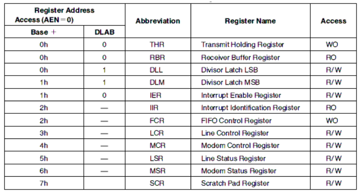

Прикладная программа должна в первую очередь корректно
инициализировать соответствующие регистры **UART**.

При этом предоставлена возможность работы по прерываниям **IRQ3** и **IRQ4**.

# 18. Стандарты, близкие к RS-232

Главным минусом **RS-232** является невозможность подключение более двух устройств.

Для решения этой проблемы и не только были разработаны **RS-422** и **RS-485**.

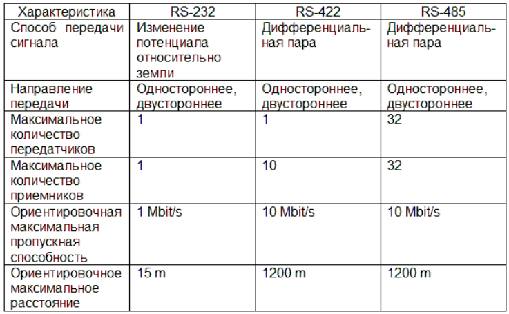

Для передачи данных посредством интерфейса RS-485 требуются
специальные трансиверы с гальванической развязкой, позволяющие
реализовать дифференциальный способ передачи сигнала.

О СрПД в стандарте не сказано, но, как правило, используют витую пару (twisted pair) и разъемы типа RJ.

# 19. Структура типового пакета компьютерной сети

Для именования порции информации, передаваемой по каналам
компьютерных (и не только компьютерных) сетей, используют обобщенный
термин _пакет (packet)_.

Пакет содержит последовательно сформированные станцией-
передатчиком _поля (fields)_, предназначенные для их интерпретации в
станции-приемнике.

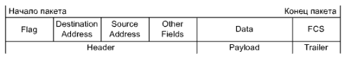

Назначение основных полей:
- Flag - флаг начала пакета, позволяет определить начало пакета;
- Destination Address - адрес назначения, позволяет указать станцию-получателя;
- Source Address - адрес источника, позволяет указать станцию-отправителя;
- Data - «полезное» наполнение пакета;
- Frame Check Sequence - контрольная сумма, позволяет проверить целостность пакета.

Все поля в составе любого пакета можно условно разделить на полезные и служебные.

Поля до данных называют _заголовком (header)_, после данных - _хвостовиком (trailer)_.

_Примечание. При изображении структуры пакета принято располагать поля слева направо (most significant bit first, big endian)_.

# 20. Инкапсуляция и её проявления в компьютерных сетях

В соответствии с концепцией модели OSI, соседние уровни абстрагированы друг от друга.

При передвижении информации между уровнями возникает необходимость в преобразованиях структур данных, которые выражаются в _инкапсуляции_ и _декапсуляции_.

Под _инкапсуляцией (encapsulation)_ понимают вкладывание пакета вышестоящего уровня в поле данных пакета смежного нижестоящего уровня, т.е. продвижение сверху вниз.

Под _декапсуляцией (decapsulation)_ понимают обратное действие после приема, т.е. продвижение снизу вверх.

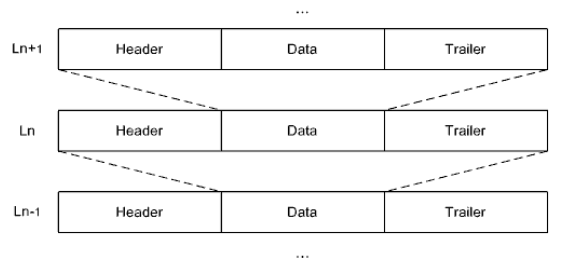

## 20.1. Декапсуляция

Функционал вышестоящего уровня «знает», какие нижестоящие ресурсы его необходимы, поэтому процесс инкапсуляции не доставляет трудностей.

Однако функционал нижестоящего уровня при разборе пакетов заранее не «знает», какой из вышестоящих подсистем его передавать, поэтому в структуру пакета вводят служебное поле, указывающее протокол вышестоящего уровня.

## 20.2 Туннелирование

Туннелирование - это процесс, в ходе которого создаётся логическое соединение между двумя конечными точками посредством инкапсуляции различных протоколов.

От обычных многоуровневых сетевых моделей туннелирование отличается тем, что в качестве туннеля используется протокол более высокого или такого же уровня.

Пример:

Допустим, у вас есть компьютер А, который находится в частной локальной сети, и вы хотите безопасно передавать данные между компьютером А и компьютером B, который находится в другой частной локальной сети через интернет.

Данные от компьютера А упаковываются в новый пакет, создавая таким образом "туннель". Этот процесс может включать в себя шифрование данных и добавление дополнительной информации для обеспечения безопасности и аутентификации.

Упакованный туннель передается через открытую сеть, такую как Интернет, где данные могут быть подвергнуты угрозам безопасности.

Когда упакованный туннель достигает компьютера B, данные распаковываются, восстанавливая оригинальный пакет. Этот процесс может включать в себя дешифрование данных и проверку целостности.

## 20.3 Фрагментация

Фрагментация – разбиение данных на части для передачи цепочки пакетов, которое применяется, если при выполнении инкапсуляции данные не помещаются в поле отведенной длины.

Если длина поля данных фиксирована, а инкапсулируемых данных не хватает, то возникает необходимость в автодополнении.

## 20.A Перемежение

_Перемежение (interleaving)_ позволяет «распараллелить» пересылку
пакетов или их фрагментов и заключается в одновременном задействовании
нескольких каналов.

Контроль за порядком фрагментов может быть возложен как на протокол
подверженного фрагментации уровня, так и на протокол вышестоящего
уровня.

# 20-21.A. Причина применения стаффинга

Поскольку станция-приемник может начать работу в произвольный момент времени, возникает проблема, связанная с распознаванием флага начала пакета.

Флаг начала пакета представляет собой зарезервированную цифровую последовательность.

Проблема заключается в том, что такая же последовательность может встретиться в пакете и после начала флага, следовательно, возникает задача обеспечения уникальности флага начала пакета, т.е. исключения этой последовательности из оставшейся части пакета.

Это достигается за счет действия, заключающегося в модификации
следующей за флагом цифровой последовательности, которое в _бит-ориентированных системах_ называют _бит-стаффингом_, а в _байт-ориентированных_ - _байт-стаффингом_.

## 21. Бит-стаффинг

См. 20-21.А.

При бит-стаффинге совпадающая с флагом последовательность
разбивается с помощью вставки дополнительно бита с соответствующим
значением.

Обычно используется в аппаратных реализациях.

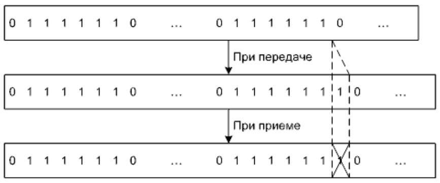

# 22. Байт-стаффинг

См. 20-21.А.

Цель байт-стаффинга полностью совпадает с целью бит-стаффинга и заключается в обеспечении уникальности флага путем замены совпадающего с ним байта на какой-то другой.

Для отличения замененного байта от незамененного применяется так называемый ESC-символ:

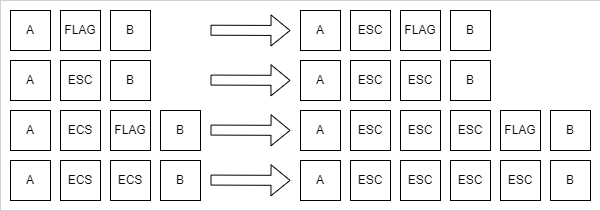

Обычно используется в программных реализациях.

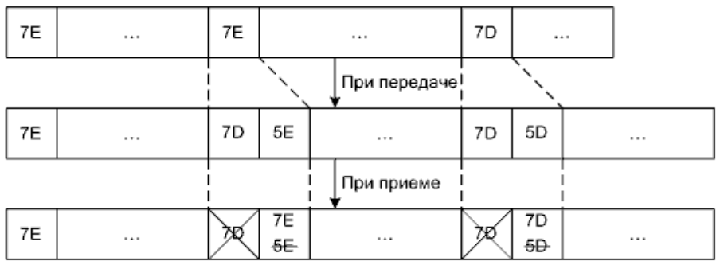

# 23. Особенности линейного кодирования и классификация линейных кодов, применяемых в компьютерных сетях

Одной из основных предпосылок для разработки линейных кодов,
является проблема, проявляющаяся во многих системах передачи цифровой информации, известная как _девиация несущей (carrier deviation)_ и заключающаяся в накоплении фазовых сдвигов из-за различия источников синхронизации у приемника и передатчика.

Все линейные коды, в той или иной степени, направлены на
преобразование битовых последовательностей, чтобы в линии постоянно
происходили изменения, в том числе за счет равномерного распределения нулей и единиц.

Шесть факторов, влияющих на классификацию линейных кодов:
1. Кодирование уровнями либо переходами;
2. Наличие инвертирования;
3. Однополярность либо многополярность;
4. Наличие так называемого «возврата к нулю»;
5. Наличие самосинхронизации;
6. Наличие перестановки или подмены битов.

# 24. Линейные коды без возврата к нулю и с возвратом к нулю

## 24.1. Линейные коды без возврата к нулю

NRZ-коды выражаются в изменении уровней между тактами: в простейших случаях, логические уровни в исходной последовательности не преобразуются совсем либо инвертируются.

Более сложными случаями являются space и mark: 
- при space-варианте ноль во входной последовательности кодируется сменой текущего уровня в выходной, а единица - сохранением текущего уровня;
- при mark-варианте, наоборот, единицы в исходной последовательности приводят к переключению уровней.

NRZ-коды могут быть однополярными и двухполярными.

Требуется наличие дополнительной цепи для тактирования.

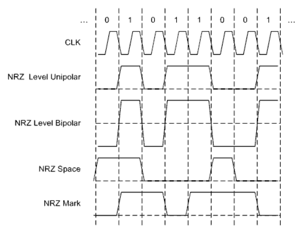

Используются в RS-232 и USB.

## 24.2. Линейные коды с возвратом к нулю

RZ-коды также выражаются в изменении уровней между тактами, но на половине каждого такта всегда происходит возврат к нулю.

Двухполярные RZ-коды обладают свойством самосинхронизации.

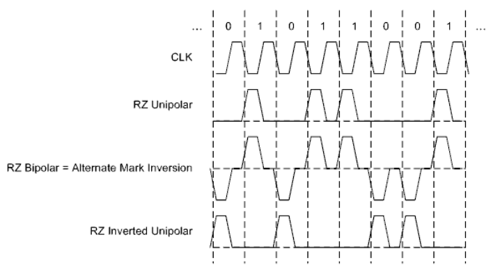

Пример технологии с применением RZ-кодов: IrDA.

# 25. Манчестерские и многоуровневые линейные коды

## 25.1. Манчестерские линейные коды

Манчестерские коды выражаются в переходах между уровнями во время
тактов, поэтому их иногда называют фазовыми кодами.

Обычно ноль кодируется переходом от логической единицы к нулю, а единица - переходом от логического нуля к единице, однако возможна и инверсная реализация.

Манчестерские коды обладают свойством самосинхронизации.

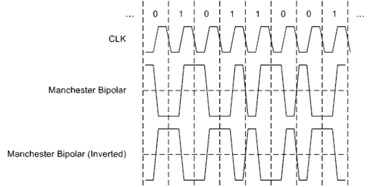

Примеры технологий с применением манчестерских кодов: Ethernet, Token Ring, некоторые IR-технологии.

### 25.1.A. Коды, близкие к манчестерским

Согласно _коду Миллера_, ноль соответствует отсутствию перехода
во время такта, единица соответствует переходу во время такта, плюс между
двумя нулями всегда выполняется смена уровня.

Согласно _коду Split Phase_ учитывается направление предыдущего перехода:
- при space-варианте ноль соответствует переходу во время такта в направлении, противоположном направлению предыдущего перехода, единица соответствует переходу во время такта в направлении, совпадающем с направлением предыдущего перехода;
- при mark-варианте «роли» нулей и единиц из входной последовательности инвертируются.

Согласно _коду Biphase_, кроме возможных переходов во время тактов,
всегда выполняется смена уровня между тактами:
- при space-варианте ноль соответствуют переходу во время такта, единица соответствуют отсутствию перехода во время такта;
- при mark-варианте «роли» нулей и единиц из
входной последовательности инвертируются.

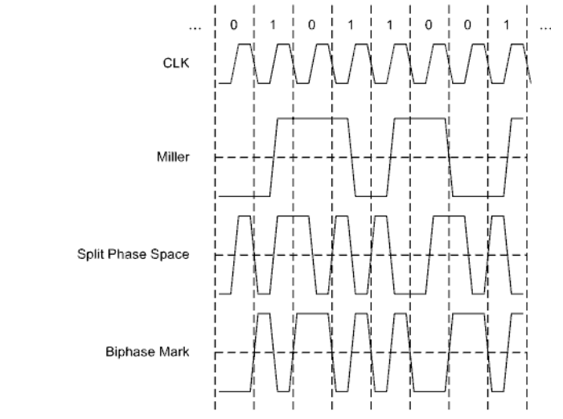

## 25.1. Многоуровневые линейные коды

MLT-коды выражаются в переключении между несколькими уровнями
между тактами.

Например, код MLT-3 имеет три уровня: -1, 0, +1:
- ноль в исходной последовательности кодируется сохранением текущего уровня;
- единица - переходом к соседнему уровню (с сохранением направления, если это возможно).

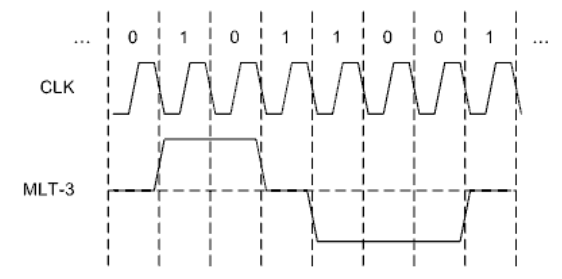

Примеры технологий с применением MLT-кодов: Fast Ethernet, FDDI.

# 26. Блочные линейные коды

Блочные коды выражаются в замене блоков битов из входной
последовательности на большие (как правило) по размеру блоки битов в выходной последовательности.

Блочные коды могут комбинироваться с другими линейными кодами.

В связи с избыточностью блочных кодов, во многих из них предусмотрены контрольные последовательности.

Первым примером может служить код _4b/5b_, применяемый в Fast Ethernet.

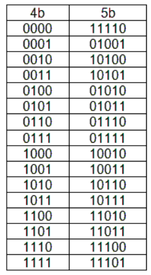

Более сложным примером может служить код _8b/10b_, применяемый в
оптических вариантах Gigabit Ethernet.

Биты входного блока обозначают как _ABCDEFGH_ - от младшего к
старшему, выходного _abcdefghij_ - так же от младшего к старшему.

Входной блок разбивается на два подблока: _x_ из пяти битов и _y_ из трех битов, поэтому выходной код представляет собой конкатенацию двух кодов: _5b/6b_ и _3b/4b_.

Кроме собственно блоков данных _D_, имеются контрольные блоки _K_,
которые кодируют альтернативно.

Таким образом, входной блок обозначают как _Dx.y_ либо _Kx.y_.

Наконец, в код _8b/10b_ заложена гибкая система уравнивания количества нулей и количества единиц, заключающаяся в динамическом выборе блока для замены (одного из двух) исходя из текущего значения так называемого _RD (Running Disparity)_. 
Предусмотрено два значение _RD_: -1 и +1. 
При выборе текущего значения _RD_ учитывается предыдущее значение _RD_ и соотношение нулей и единиц во входном блоке (плюс есть исключения).

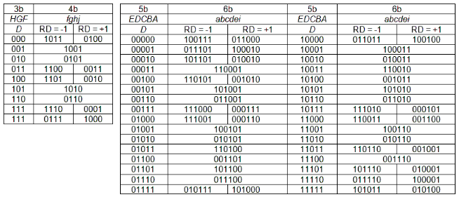

# 27. Поля Галуа и их применение в компьютерных сетях

Многие помехоустойчивые коды, используемые в компьютерных сетях, основываются на операциях с применением _полей Галуа_.

## 27.1 Определение

Поля Галуа принято записывать как
$$GF(p^n)$$
где
- $p$ – простое число, характеристика поля; 
- $n$ – порядок поля. 

С точки зрения компьютерных вычислений естественно использовать $p = 2$. 

Поле Галуа состоит из конечного числа чисел, все операции над которыми дают в результате некоторое другое число из этого же поля Галуа.

## 27.2. Применение полей Галуа в кодировании

Для практического применения полей Галуа в компьютерных системах необходимо перейти от скалярного представления к векторному, а затем - к полиномиальному.

# 27.A. Некоторые теоретические сведения из общей алгебры

_Полугруппой_ называется множество с заданной на нем ассоциативной бинарной операцией.

_Моноидом_ называется полугруппа с нейтральным элементом, часто называемым единицей.

_Группой_ называется моноид, где для каждого элемента существует обратный.

_Абелевой (аддитивной) группой_ называется группа с коммутативной операцией.

_Кольцом_ называется абелева группа, на которой задана вторая бинарная операция «умножения», удовлетворяющая аксиомам дистрибутивности.

_Телом_ называется кольцо с единицей, в котором каждый ненулевой элемент обратим.

_Полем_ называется коммутативное тело.

_Конечным полем (полем Галуа)_ называется поле, состоящее из конечного числа элементов; это число называется порядком поля. 

# 28. Модель помехоустойчивого канала связи и теорема Шеннона

_Теорема Шеннона_ утверждает, что любой дискретный канал связи имеет
конечную пропускную способность и этот канал может быть задействован для передачи информации со сколь угодно большой степенью достоверности, несмотря на наличие помех.

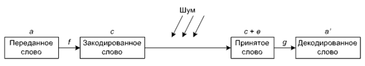

Передаваемое сообщение разбивается на блоки фиксированного
размера $a$ из $k$ битов $\{a_1, a_2 ..., a_k\}$.

Кодер выполняет функцию $f$, называемую _схемой кодирования_, и тем самым преобразует вектор $a$ в вектор $c$ из $n > k$ битов $\{c_1, c_2, ..., c_n\}$, называемый _кодовым словом_.

В процессе пересылки кодового слова по каналу связи на него накладывается _вектор ошибок_ $e$, в котором единичные биты соответствуют искажениям.

После применения декодером _схемы декодирования_ $g$ получается вектор $a'$, в идеале совпадающий с исходным вектором $a$.

В КС множество кодовых слов получается из множества исходных слов
как отображение из конечного поля $GF(2^k)$ в конечное поле $GF(2^n)$.

# 29. Линейные помехоустойчивые коды, включая коды Хэмминга и циклические коды

Линейные помехоустойчивые коды предоставляют возможность обнаружения ошибок в пересланном сообщении или их _исправления (самокоррекция)_.

Если $H$ - матрица размером $(n-k) \times n$ ранга $n-k$ и $H \space c^T =0$,то множество всех $n$-разрядных векторов, входящих в поле $GF(2n)$ (в общем случае $GF(pn)$), называют _линейным $(n,k)$ - кодом_ (в математическом смысле) длины $n$ и размерности $k$. А матрицу $H$ называют _проверочной_.

Линейный код по-другому называют _групповым_, так как множество кодовых слов можно рассматривать как подгруппу в отношении поля $GF(2n)$.

Линейный код называют _систематическим (разделенным)_ если расположение проверочных битов известно (не важно где они находятся), то есть если $H=[A \space I_n-k]$,где $A$ - матрица размером $(n-k) \times k$, а $I_n-k$ - единичная матрица ранга $n - k$.

Матрицу $G = [I_k -A^T]$ размером $k \times n$ называют _кодирующей (порождающей) матрицей систематического кода_.
Кодирующая и проверочная матрицы связаны следующим образом: $GH^T = 0$.

Число координат (позиций), которыми два вектора $x$ и $y$ различаются называют _расстоянием Хэмминга_ - $d(x,y)$.

Число ненулевых позиций вектора $x$ называют _весом Хэмминга_ - $w(x)$.
Видно, что расстояние Хэмминга показывает количество возникших ошибок.

Для увеличения корректирующей способности кода следует стремиться увеличивать расстояния между кодовыми словами. При этом минимальное расстояние $d_{min}$ называют кодовым и оно является очень важной характеристикой помехоустойчивого кода.
Согласно теореме, для того чтобы линейный код исправлял $t$ ошибок должно выполняться условие: $d_{min} ≥ 2t + 1$. Для того, чтобы линейный код обнаруживал t ошибок должно выполняться условие: $d_{min} ≥ t + 1$.

_Код Хэмминга_ - самоконтролирующийся и самокорректирующийся код, позволяющий обнаруживать множественную и исправлять одиночную ошибку.

_Кодом Хэмминга_ называют код длины $n = 2m - 1, m ≥ 2$ с проверочной матрицей $H$ размером $m \times (2m - 1)$, в которой столбцы соответствуют записи $1, 2 ... 2m - 1$ в двоичной системе счисления.

_Циклический код_ позволяет обнаруживать и исправлять множественные ошибки.

_Циклическим кодом_ называют линейный код, удовлетворяющий дополнительному условию: если вектор $a_0, a_1 ... a_{n-1}$ является кодовым словом, то и его циклический сдвиг $a_{n-1}, a_0 ... a_{n-2}$ так же является кодовым словом.

Идея циклических кодов заключается в делении информационных битов на некоторый порождающий неприводимый полином и передачи остатка от деления в виде контрольной суммы.

Принимающая сторона повторяет деление полученной последовательности, и, если остаток не равен нулю, приступает к восстановлению сообщения (например, при помощи синдромов).

# 30. Классификация помехоустойчивых кодов

Существуют помехоустойчивые коды, способные:
- обнаруживать ошибки;
- исправлять ошибки.

Основные виды помехоустойчивых кодов:
- _линейные коды_ - коды Хэмминга, циклические коды, коды Боуза-Чоудхури-Хоквингема, коды Рида-Маллера, итеративные коды, коды на основе матриц Адамара;
- _коды для контроля модульных и пакетных ошибок_ - коды Рида-Соломона, низкоплотные модульные коды, векторные модульные коды, итеративные модульные коды;
- _сверточные коды_;
- _арифметические коды_;
- _низкоскоростные коды_ - коды максимальной длины, нелинейные коды, D-коды.

## 30.A. Немного о классификациях

Великое многообразие литературы по помехоустойчивым кодам порождает не меньшее число различных классификаций, каждая из которых рассматривает вопрос с точки зрения различных приложений.

На рисунке ниже представлена одна из классификаций алгебраических помехоустойчивых кодов.

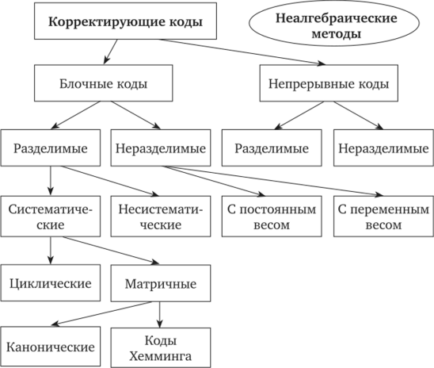

# 31. Классификация каналов в сети передачи данных

По направленности:
- симплексный - передача по каналу возможна только в одном направлении;
- полудуплексный - данные могут передаваться в обоих направлениях, но в один момент времени возможна передача только в одном направлении;
- полнодуплексный - данные могут передаваться в обоих направлениях одновременно.

Сейчас доминируют полнодуплексные каналы.

Последовательный канал может быть:
- выделенным - зарезервирован за определенной парой станций-абонентов;
- разделяемым - может использоваться несколькими станциями-абонентами;

По времени существования:
- коммутируемый – временный, создается только на время передачи информации, по окончании передачи информации и разъединении уничтожается;
- некоммутируемый – создается на длительное время с определенными постоянными характеристиками.

# 32-33.А. Типы и виды топологий сетей

Разделяют следующие типы топологий:
- Point-to-point - связывает две станции;
- Multipoint-to-multipoint - связывает более двух станций.

Однонаправленные (очень редко):
- Point-to-multipoint;
- Multipoint-to-point.

Разделяют два вида топологий:
- физическая топопогия - отражает физические связи
между устройствами.
- логическая топопология - отражает логические связи между устройствами.

# 32. Логические и физические топологии LAN

См. 32-33.А.

Для LAN характерны топологии:
- Шина (bus);
- Кольцо (ring);
- Звезда (star).

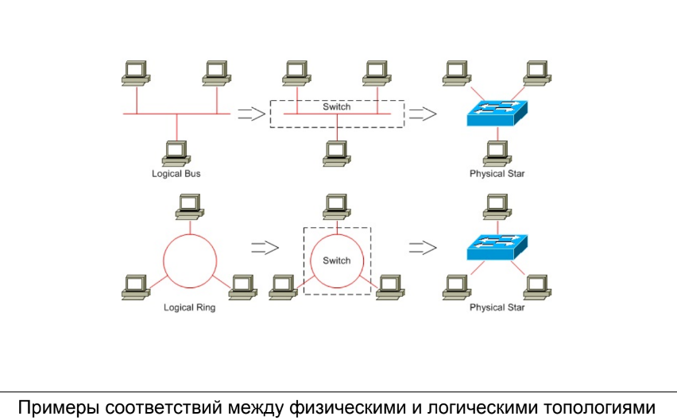

# 33. Логические и физические топологии WAN и RAS

См. 32-33.А.

Для WAN характерны топологии:
- Сеть (mesh);
- Ступица со спицами (hub-and-spokes);
- Полносвязаная сеть (full-mesh).

Характерной RAS-топологией является point-to-point.

Можно сказать, что для ГКС-технологий существует только одна типичная топология (произвольно связанная сеть), остальные можно рассматривать как ее частные случаи.

_Примечание. Под ГКС понимается глобальная компьютерная сеть_.

# 34. Особенности случайных методов доступа к моноканалу

В первую очередь алгоритмы затрагивают передатчики, то есть 
активные компоненты системы. Проблема заключается в 
«столкновениях» конкурирующих передатчиков.
Если находящиеся в равных условиях два либо более передатчиков
одновременно выдают сигналы в СрПД, то возникает противоречие. 

Таковое единовременно неразрешимое противоречие принято называть коллизией (collision). 

Коллизия может быть как логической (информационный конфликт) так и физической (несовместимые  физические процессы). 
Обычно коллизия возникает при попытках  установить противоположные логические уровни.

Ситуация с коллизией может затрагивать только станции, 
подключенные к одной СрПД, то есть сегмент компьютерной сети.
Сегмент, в котором возможно возникновение коллизий называют 
доменом коллизий (collision domain). 

Понятие коллизии имеет отношение не только к сигналу, а и к пакету.

При случайном методе существуют два подхода: 
- допускать коллизии  и как-то выходить из них (CSMA/CD);
- стараться максимально не допускать коллизии (CSMA/CA).

Все случайные методы основаны на использовании генератора 
случайных чисел, который используется для генерации случайных 
задержек при доступе к моноканалу.

На эффективность случайных методов наиболее существенно влияют следующие факторы:
- количество взаимодействующих станций;
- длина кадра;
- частота синхронизации;
- инертность среды передачи данных.

# 35. CSMA/CD (Ethernet)

CSMA/CD (Carrier Sense Multiple Access with Collision Detection) - множественный доступ с прослушиванием несущей и обнаружением коллизий.

 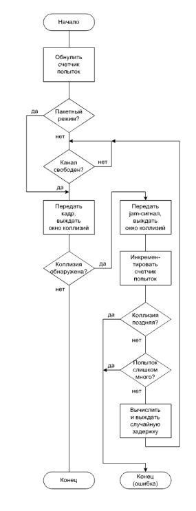

передача очередного кадра

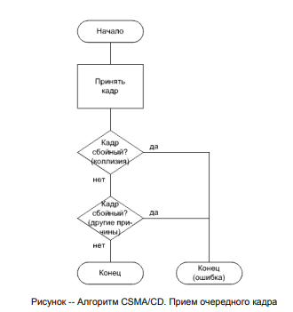


<!-- константы не относятся к рисунку, они для формулы ниже -->
- $Tcw$ – время окна коллизии, равное удвоенному времени прохождения сигнала между двумя максимально удаленными станциями;
- $Tj$ – время передачи jam-сигнала;
- $Ts$ – слот-тайм, минимальная неделимая единица времени при диспетчеризации, $Ts > Tcw + Tj$.

Сперва станция дожидается пока канал не будет свободен.

После этого посылает фрейм и ждет Tcw.

Если коллизия была обнаружена, то необходимо послать специальный jam-сигнал, чтобы другие станции тоже узнали о коллизии, и выждать Tcw. Jam-сигнал позволяет станциям синхронизировать начало отсчета случайных задержек.

После этого необходимо инкрементировать счётчик попыток, если количество попыток перевалит за 16, то считается, что в моноканале не удастся передать сообщение (ошибка).

Далее необходимо сгенерировать время для ожидания в слот-таймах:

В случае неудачи следует сгенерировать время для ожидания в слот-таймах:

$$0 <= r <= 2^k$$

где 
- $r$ – число, умножив которое на $Ts$ получается время для случайного выжидания; 
- $k = min (n, 10)$, $n$ – номер попытки.

После выжидания следует вновь дождаться свободности канала и повторить попытку отправки сообщения.

После удачной передачи сообщения счетчик должен обнулиться.

# 36. Кадр Ethernet

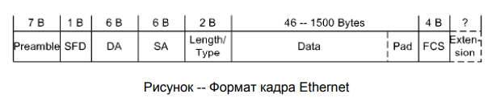

Кадр Ethernet состоит из следующих полей:
- Preamble – преамбула;
- SFD (Start Frame Delimiter) – разграничитель начала кадра;
- DA – адрес назначения;
- SA – адрес источника;
- Length/Type – длина или тип (если больше 600h);
- Data – данные;
- Pad – наполнитель, если размер для данных больше, чем реальная длинна передаваемого сообщения;
- FCS (Frame Check Sequence) – контрольная сумма, используется для обнаружения ошибок.

При сборке кадра учитываются ограничения на его длину:
ограничивается не только максимальная длина, но и минимальная.

При недостаче в поле данных вслед за ним в кадр вставляются
дополнительные октеты - наполнители (значения стандартом не регламентированы).

Параметр MTU (Maximum Transmission Unit) определяет максимальный размер вкладываемых данных.

Применительно к Ethernet, если значение поля Length/Type больше либо равно 1536 (600h), то указывает тип инкапсулируемых данных. 

При необходимости, октеты-расширители дополняет кадр до тайм-слота (только в полудуплексном режиме).

Ethernet-заголовок имеет фиксированную длину.

Но, поскольку многие базирующиеся на Ethernet технологии (например, VLAN) имеют собственные подзаголовки, заголовок, а следовательно и весь кадр, может увеличиться, правда незначительно и не затрагивая MTU (такие кадры иногда называют baby giant). 

Некоторые технологии предусматривают значительное увеличение кадра уже за счет увеличения MTU. Например, параметр MTU технологии FCoE (Fibre Channel over Ethernet) равен 2500 байтам (такие кадры иногда называют mini jumbo). 

Наконец, многие производители оборудования Ethernet предусмотрели нестандартное (но в большинстве случаев совместимое) административное увеличение MTU вплоть до 9000 байтов - в первую очередь, для оптимизации пересылки больших объемов данных. Такие Ethernet-кадры называют гигантскими (jumbo).

# 37. CSMA/CA (Wi-Fi)

Гораздо более сложный алгоритм CSMA/CA (Carrier Sense Multiple Access with Collision Avoidance) - множественный доступ с прослушиванием несущей и избеганием коллизий.

Применительно к Wi-Fi, MAC-подуровень канального уровня поделен еще на два слоя. 

На нижнем слое расположен только один блок под названием DCF (Distributed Coordination Function) - функционал распределенного координируемого взаимодействия (составляет ядро алгоритма CSMA/CA). 

Все станции сегмента должны поддерживать DCF. 

Над DCF расположены:
1. PCF (Point Coordination Function) - функционал координируемого взаимодействия с использованием станции-координатора;
2. HCF (Hybrid Coordination Function) - функционал гибридного координируемого взаимодействия;
3. MCF (Mesh Coordination Function) - функционал сеточного координируемого взаимодействия.

Из них формируются следующие опциональные блоки:
1. PCF - функционал координируемого взаимодействия с использованием станции-координатора;
2. HCCA (HCF Controlled Access) -  метод управляемого доступа к каналам с помощью функции гибридной координации для контроля доступа к среде;
3. EDCA (HCF/MCF Contention Access) - конфликтный доступ к HCF/MCF;
4. MCCA (MCF Controlled Access) - контролируемый доступ к функционалу сеточного координируемого взаимодействия.

Кроме DCF, наибольший интерес представляет PCF.

Остальные блоки предназначены для поддержки QoS.

В настоящее время реализации Wi-Fi на физическом уровне (беспроводные) очень разнообразны - используются до десяти различных способов модуляции. Более того, для Wi-Fi характерно создание большого числа параллельных каналов.

Стандартом предусмотрены целых шесть вариантов отслеживаемых межкадровых интервалов --IFSes (InterFrame Spaces):
1. RIFS (Reduced IFS) -- сокращенный;
2. SIFS (Short IFS) -- короткий;
3. PIFS (PCF IFS) -- для PCF;
4. DIFS (DCF IFS) -- для DCF;
5. AIFS (Arbitration IFS) -- для QoS-арбитража;
6. EIFS (Extended IFS) -- расширенный.

Отслеживание различных IFSes в различных ситуациях влияет на способность станции «видеть щели» между кадрами, а значит и на способность «вклиниваться» в пересылку.

Количество слот таймов находится в диапазоне:

$$0 <= r <= CW,$$

где $CW$ (contention window) – окно состязаний, находится в диапазоне ($𝐶𝑊𝑚𝑖𝑛 ≤ 𝐶𝑊 ≤ 𝐶𝑊𝑚𝑎𝑥$) и берется из ряда $\{2^n - 1: (7, 15, 31, …)\}$, крайние значения зависят от возможностей физического уровня (типичные значения $𝐶𝑊𝑚𝑖𝑛 = 15$, $𝐶𝑊𝑚𝑎𝑥 = 1023$).

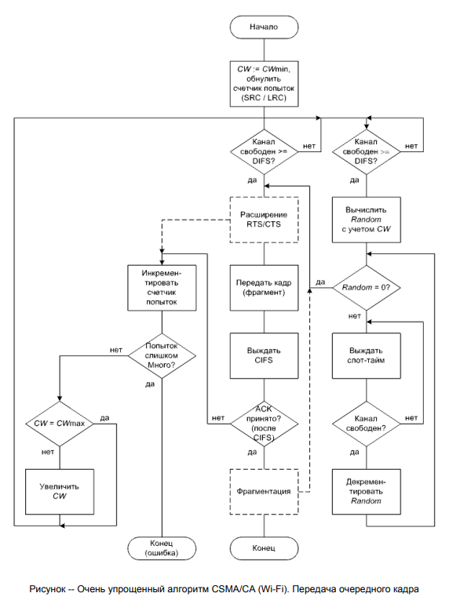

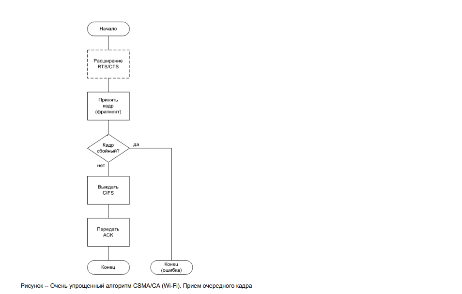

# 38. Кадры Wi-Fi

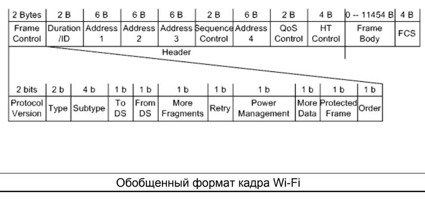

1. Frame Control – контроль кадра
2. Duration/ID – длительность-идентификатор (связано с QoS)
3. Address 1
4. Address 2
5. Address 3
6. Sequence control – контроль последовательности
7. Address 4
8. Frame Body – данные
9. FCS (Frame Control Sequence) – контрольная сумма
 
Поля контроля кадра:
1. Protocol version – версия протокола (до сих пор равна нулю)
2. Type – тип (0 – управление, 1 – контроль, 2 - данные)
3. Subtype – подтип
4. To DS – флаг направления к проводной системе
5. From DS – флаг направления из проводной системы
6. More Fragments – флаг, сообщающий о наличии ещё фрагментов для отправки (связан с фрагментацией в WiFi)
7. Retry – флаг повторной попытки передачи
8. Protected Frame – флаг шифрования

В WiFi в зависимости от подтипа кадра в полях адресов могут располагаться:
- BSSID – идентификатор беспроводного сегмента
- SA – адрес источника
- DA – адрес назначения
- TA – адрес станции-передатчика
- RA – адрес станции-приемника

# 39. Особенности детерминированных методов доступа к моноканалу

Детерминированные методы доступа к моноканалу хорошо ложатся на кольцевую топологию. Кольцо можно представить как моноканал, один такт которого равен полному либо частичному обходу кадром всех станций.

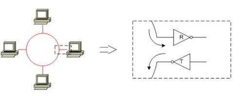

В кольце не может возникнуть коллизий аналогичных коллизиям при шинной топологии, однако есть логические коллизии: если станция имеет собственный кадр для передачи и при этом получила из кольца ещё один кадр, то появляется задача определения какой кадр передавать дальше.

Для решения логических коллизий внедряется система приоритетов и арбитра, управляющего ими. Такой арбитр принято называть маркером (token).

На эффективность детерминированных методов наиболее существенное влияние оказывают те же факторы, что и в ситуациях со случайными методами:
- количество взаимодействующих станций;
- частота синхронизации;
- длина кадра.

# 40. Алгоритм Token Ring

Token Ring — протокол передачи данных в локальной вычислительной сети (LAN) с топологией кольца и «маркерным доступом». Находится на канальном уровне модели OSI.

В Token Ring предусмотрено централизованное управление, которое реализуется управляющей станцией (станцией-монитором). 

В задачи управляющей станции входит инициализация подключившихся к кольцу станций, тактирование кольца, контроль над валидностью маркера и предотвращение зацикливания.

Функции станции-монитора:
1. инициализировать подключившиеся к кольцу станции;
2. тактировать работу кольца;
3. контролировать наличие и валидность маркера;
4. предотвращать зацикливания.

Есть 4 вида передаваемых последовательностей:
- Token(маркер);
- Frame(кадр);
- Abort Sequence(прерывающая последовательность);
- Fill(заполняющая последовательность).

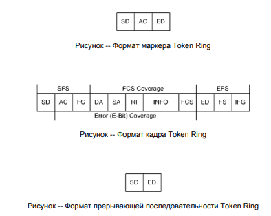

Расшифровка полей структуры маркера, кадра, прерывающей последовательности:
1. SD (Starting Delimiter) - начальный разделитель;
2. AC (Access Control) - контроль доступа;
3. FC (Frame Control) - контроль кадра;
4. DA (Destination Address) - адрес назначения;
5. SA (Source Address) - адрес источника;
6. RI (Routing Information) - информация о маршрутизации (может отсутствовать);
7. INFO (Information) - данные (могут отсутствовать);
8. FCS (Frame Check Sequence) - контрольная сумма;
9. ED (Ending Delimiter) - конечный разделитель;
10. FS (Frame Status) - состояние кадра;
11. IFG (InterFrame Gap) - межкадровый интервал;
SD и ED фактически являются флагами начала и конца кадра.

Между IFG и SD передается заполняющая последовательность.

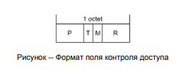

Формат поля контроля доступа:
1. P (Priority bits) - текущий уровень приоритета;
2. T (Token bit) - идентификатор маркера: 0 - маркер, 1 - кадр;
3. M (Monitor bit) -- бит монитора;
4. R (Reservation bits) - запрашиваемый уровень приоритета. 

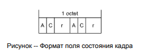

Формат поля состояния кадра:
1. A (Address-recognized bit) - флаг распознания адреса (дублируется);
2. C (frame-Copied bit) - флаг копирования кадра (дублируется);
3. r (reserved) - зарезервировано. 

Маркер передается по цепочке от станции к станции. Если у станции нет кадра для передачи, то она передает маркер дальше, если есть, то она захватывает маркер и преобразует его в кадр для передачи. Если передаваемый кадр придет на станцию, с кадром большего приоритета, то дальше будет передаваться он.

После прихода кадра к станции-назначению, она выставляет поля A и C, таким образом показывая, что сообщение успешно прочитано. За удаление кадра отвечает станция, его создавшая. После этого маркер освобождается и передается далее.

Существуют оптимизация early token release: сразу вслед за кадром передается новый маркер, а старый маркер не воссоздается, таким образом в кольце одновременно может передаваться несколько кадров.

Владение маркером ограничено во времени и контролируется с помощью таймера THT (Token Holding Time).

Стековая станция – станция, имеющая два стека LIFO, использующихся для сохранения старого и нового приоритетов при его замене в кольце.

# 41. Реализации детерминированных методов доступа к моноканалу

Некоторые детерменированные методы доступа к моноканалу:
- ARCNET - была популярна до распространения Ethernet, алгоритм Token Ring, но без приоритетов, логическая топология – однонаправленное кольцо, физическая топология – шина или звезда;
- Token Bus - разрабатывали параллельно с Token Ring, стандарт 802.4, логическая топология – однонаправленное кольцо, физическая топология - шина;
- FDDI/CDDI (Fiber/Copper Distributed Data Interface) - FDDI разрабатывался специально для оптических СрПД, но быстро был вытеснен Fast Ethernet, логическая топология – однонаправленное кольцо с резервированием, физическая топология – двойное кольцо;
- 100VG-AnyLAN - была альтернативой Fast Ethernet, гибрид между Ethernet и Token Ring с совместимостью с их кадрами, стандарт 802.12, логическая топология – дерево, физическая топология - дерево.

# 42. Адресация в компьютерных сетях и классификация адресов

Адресация всегда «привязана» к некоторому протоколу, а
протокол, в свою очередь, «привязан» к уровню модели OSI. Поэтому
закономерно, что на каждом из уровней присутствует своя независимая система адресации.

В форматах большинства пакетов обязательно должны присутствовать адрес назначения и адрес источника.

В каждом пакете должны присутствовать по крайней мере адреса канального уровня.

В большинстве же практических реализаций семейств протоколов, кроме адресации на канальном уровне, предусмотрена адресация на сетевом (в связке с транспортным) и прикладном уровнях.

Адреса канального уровня «зашиваются» в сетевое оборудование при его производстве, поэтому повторяться не должны. Они не предполагают возможность пользовательского вмешательства и их считают абсолютно уникальными. Часто (в том числе Cisco) такую адресацию называют физической (physical). 

Адреса сетевого и прикладного уровней назначают пользователи. Часто (в том числе Cisco) такую адресацию называют логической (logical).

Кроме всего прочего, даже на одном уровне модели OSI адресация может быть иерархической (hierarchical)

В рамках функционирования сетевой ОС можно выделить объекты:

- Сетевой процесс (network process) - представляет собой пару: процессор и выполняющаяся на нем сетевая (то есть использующая сетевые ресурсы) программа; причем, если меняется хотя бы один из этих компонентов, то получается новый процесс.
- Сетевой ресурс (network resource) - это любой компонент вычислительной системы, который может быть предоставлен в пользование сетевому процессу на определенное время.

Для того, чтобы взаимодействующие сетевые процессы могли найти друг друга, во всех реальных системах используется три уровня адресации:
- Необходимо адресовать подсеть - используется адрес подсети (subnet address).
- Необходимо адресовать станцию в подсети - используется адрес станции (node address).
- Необходимо адресовать процесс в станции - используется так называемый адрес программного порта (software port).

Существует 4 типа адресации:
- unicast – пакет предназначен конкретной станции;
- broadcast – пакет должен быть обработан всеми станциями;
- multicast – пакет должен быть обработан всеми станциями в определенной группе;
- anycast – пакет должен быть обработан одной станцией из группы (самая сложная, подразумевает наличие алгоритма выбора конкретной станции из группы).


Типы адресов:
- физический (MAC-адрес)
- сетевой (IP-адрес)
- символьный (DNS-имя)

# 43. MAC-адреса

MAC-адрес – это адрес канального уровня модели OSI, используется для уникальной идентификации сетевого оборудования. 

Уникальность MAC-адресов контролирует IEEE Registration Authority.

МAC-адрес состоит из 48 бит.

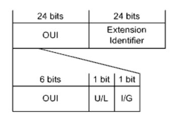

Поля MAC-адреса:
- OUI (Organizationally Unique Identifier) - уникальный идентификатор организации (производителя);
- U/L (Universal/Local) - признак универсальности-локальности адреса;
- I/G (Individual/Group) - признак индивидуального-группового адреса;
- Extension Identifier - идентификатор-наполнитель.

OUIs выдают централизовано, уникальность оставшейся части должны обеспечивать сами организации (любым способом по своему усмотрению).

По правилам IEEE MAC-адреса записывают в следующей нотации:

$${XX-XX-XX-XX-XX-XX}$$

где $X$ - шестнадцатеричная цифра в верхнем регистре, но очень часто используют и альтернативные нотации.

Все юникаст-MAC-адреса должны иметь нулевое значение бита I/G.

Адрес 

$$FF-FF-FF-FF-FF-FF$$

принято использовать в качестве бродкаст адреса.

# 44. Заголовок IPv4

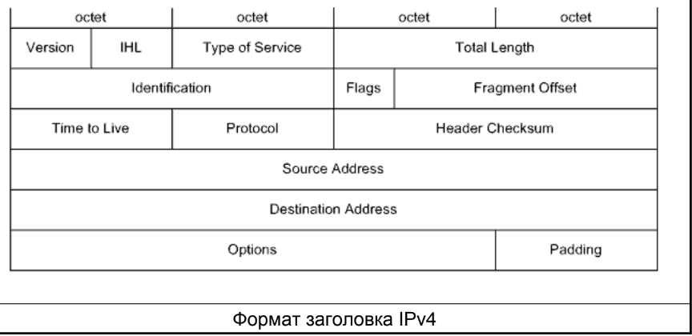

Поля заголовка IPv4:
- Version – равно 4;
- IHL (Internal header length) – длина заголовка (в 32-битных словах, минимум равно 5 минимум равно 5 - первые пять строк картики);
- Total Length – общая длинна данных (в байтах, не может превышать $2^{16} − 1$);
- Identification – уникальный идентификатор пакета (нужен при фрагментации);
- Flags:
    - первый бит пустой;
    - второй бит - флаг DF (Don’t Fragment);
    - третий бит - флаг MF (More Fragments);
- Fragment Offset – смещение текущего фрагмента;
- Time to Live – время жизни (при каждой ретрансляции уменьшается, когда равно нулю пакет уничтожается);
- Protocol – протокол, инкапсулируемый в поле данных;
- Header Checksum – контрольная сумма заголовка;
- Source Address – адрес источника;
- Destination Address – адрес назначения;
- Options – опции, например, связанные с безопасностью, размер вариативен;
- Padding – наполнитель для выравнивания опций до 32 бит.

# 45. Заголовок IPv6

Заголовок IPv6 гибкий: сколько заголовков нужно, столько и вставляется.

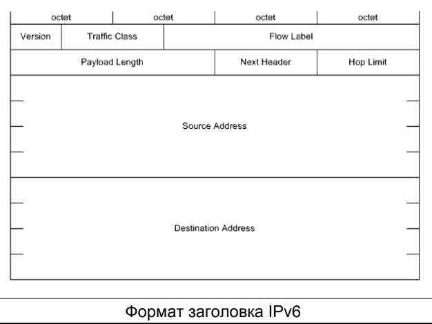

Поля заголовка IPv6:
- Version – равно 6;
- Payload length – длина полезной нагрузки;
- Next header – селектор следующего заголовка (аналог поля Protocol в IPv4);
- Hop Limit – ограничитель числа прыжков (аналог поля Time To Live в IPv4);
- Source Address – адрес источника;
- Destination Address – адрес назначения.

Полноценная реализация IPv6 должна поддерживать следующие заголовки:
1. IPv6 header - IPv6-заголовок;
2. Hop-by-Hop Options header - заголовок опций ретрансляции;
3. Destination Options header - заголовок предназначенных станции назначения опций;
4. Routing header - маршрутизационный заголовок;
5. Fragment header - заголовок фрагмента;
6. Authentication header - заголовок протокола AH (связано с защитой информации);
7. Encapsulating Security Payload header - заголовок протокола ESP (связано с защитой информации);
8. Upper-layer header - заголовок протокола вышестоящего уровня.

# 46. Протокол ARP

Группа протоколов под названием ARPs (Address Resolution Protocols) предназначена для восстановления соответствия между MAC-адресами и IP-адресами.

Под прямым ARP понимают нахождение MAC по IP. Обратное преобразование выполняется по протоколу RARP (Reverse Address Resolution Protocols).

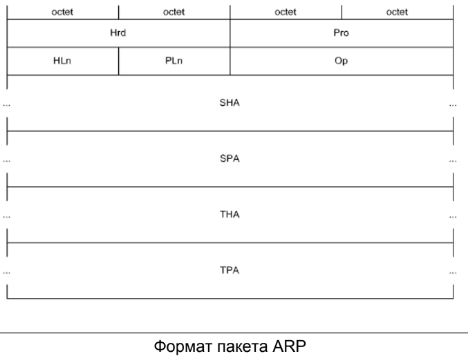

Поля пакета ARP:
- Hrd (Hardware) – тип оборудования (Ethernet - 1);
- Pro (Protocol) – протокол (IP - 800h);
- HLn (Hardware address Length) – длина аппаратного (физического) адреса в байтах;
- PLn (Protocol address Length) – длина протокольного (логического) адреса в байтах;
- Op (Opcode) – код операции: 1 – Request, 2 – Reply и д.р.;
- SHA (Sender Hardware Address) – аппаратный адрес станции-отправителя;
- SPA (Sender Protocol Address) – протокольный адрес станции-отправителя;
- THA (Target Hardware Address) – аппаратный адрес станции-получателя;
- TPA (Target Protocol Address) – протокольный адрес станции-получателя.

# 47. Структура Системы DNS

Протокол DNS _(Domain Name System «система доменных имён»)_ предназначен для восстановления соответствий между IP-адресами и адресами прикладного уровня.

Домен – совокупность устройств, работающих в рамках некоторых единых правил.

DNS нельзя однозначно сопоставить с моделью OSI.

Система DNS соответствует клиент-серверной модели и включает три основных компонента:
- Domain name space и Resource Records(Пространство доменных имен и ресурсные записи);
- Name servers (сервер, преобразующий доменные имена, с которыми работают пользователи, в понятные компьютерам IP-адреса или в обратном направлении);
- Resolvers (программы, отвечающие на запросы клиентов).

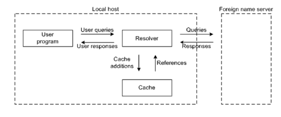

Адресное пространство доменных названий имеет иерархическую древовидную структуру. 

Каждый узел дерева обозначают меткой длиной от 0 до 63 байт (должна начинаться с буквы и может иметь в названии буквы любого регистра, цифры и символ '-'). 

Полная длина доменного названия не может превышать 255 байт. Метка с нулевой длиной является корнем дерева. 

Метки разделяют точками, и корневая метка является крайней справа. Доменное название может быть как абсолютным (absolute), то есть содержащим всю цепочку меток от станции до корневой метки, так и относительным (relative), то есть содержащим только часть меток.

# 48. Сообщения DNS

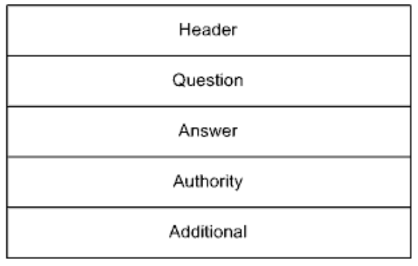

Заголовок присутствует всегда, остальные поля вариативные:
- Header – заголовок;
- Question – вопрос;
- Answer – ответ;
- Authority – авторитетный ответ;
- Additional - дополнение.

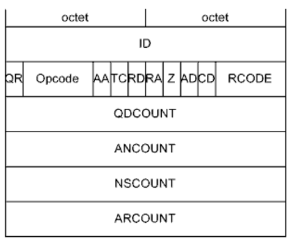

Структура заголовка сообщения:
- ID – идентификатор программы, сгенерировавшей запрос;
- Q/R – флаг запроса-ответа: 0 – запрос, 1 – ответ;
- Opcode – код операции (запроса);
- AA – флаг авторитетного ответа;
- RCODE – код ответа;
- QDCOUNT (Query DNS COUNT) – количество Resource Records в поле Question;
- ANCOUNT (Answer COUNT) – количество Resource Records в поле Answer;
- NSCOUNT (Name Server COUNT) – количество Resource Records в поле Authority;
- ARCOUNT (Additional Records COUNT) – количество Resource Records в поле Additional.

# 49. Виртуальные соединения в сети передачи данных

Одним из ключевых терминов транспортного уровня является термин соединения (connection). Если абоненты находятся в состоянии готовности передавать или принимать данные, то считают, что между ними установлено соединение.

Соединение может быть выражено неявно.

Существуют 2 вида соединений:
- Физические;
- Виртуальные.

Абоненты-программы физически соединены быть не могут, а значит к ним применимы только виртуальные соединения.

Существуют два способа организации взаимодействия:
- Без гарантированной доставки – усилия по доставке сообщений в СПД предпринимаются, но никаких гарантий нет (при необходимости, соответствующий контроль возлагается на программы-абоненты);
- С гарантией доставки – алгоритм работы транспортной службы гарантирует доставку пакетов.

Соединения без гарантированной доставки смысла не имеют.

Сокет – привязка к виртуальному каналу, соединяющему между собой два взаимодействующих между собой виртуальных процесса, с учетом всех трех уровней адресации.

# 50. Классификация оконных механизмов, используемых в сети передачи данных

Оконный метод базируется на подходе передачи нескольких пакетов перед ожиданием квитанций.

По количеству передаваемых пакетов окна классифицируют на:
- Статические – неизменяемый размер окна (заложен в протокол или устанавливается на весь сеанс обмена);
- Динамические – размер окна может изменяться в процессе передачи сообщений.

По способу обработки очереди пакетов, окно может быть:
- Фиксированным – перед формированием следующего окна должны быть приняты все соответствующие квитанции;
- Скользящим – существует возможность сдвигать окно относительно последовательности пакетов.

Наиболее сложным и гибким считается динамическое скользящие окно.

# 51. Структура системы TCP


TCP базируется на динамическом скользящем окне.

TCP соответствует клиент-серверной модели.

Применительно к каждому TCP-соединению нужно выделять приложение, производящее или потребляющее сетевые данные, и TCP-процесс, предоставляющий коммуникационные услуги (например, специальный драйвер ОС).

Синхронизировать работу приложения и TCP-процесса можно только с помощью буферизации.

TCP-интерфейс, которым пользуется приложение, состоит из примитивов для работы с буфером, позволяющих контролируя записывать или считывать данные.

Доступ к буферу имеет и TCP-процесс, который отслеживает наполнение буфера и, используя ресурсы более низких уровней, организует прием или передачу данных.

Предназначенное для передачи сообщение разбивается на сегменты.

Минимальной учитываемой в окне единицей данных является октет, то есть байт.

Все байты сообщения последовательно нумеруются так называемыми
последовательными номерами - _SNs (Sequence Numbers)_.

Нумерация начинается с некоторого начального последовательного
номера - _ISN (Initial Sequence Number)_, который как правило не равен нулю, а генерируется реализациями случайно (например, на основе текущего времени) для того чтобы лучше управлять соединениями (например, после их ненормальных завершений).

Принято, что сам ISN в нумерацию байтов не включается, то есть номер первого байта сообщения больше ISN на единицу.

Номером сегмента является SN первого байта данных в нем.

По разным понятным причинам длина сегмента может варьировать, но она имеет ограничениее, поэтому важное значение имеет конфигурационный параметр _MSS (Maximum Segment Size)_ - максимальная длина сегмента (по умолчанию 536 байтов).

По мере считывания принимающим приложением упорядоченных байтов из буфера окно скользит относительно последовательности сегментов сданными.

Если размер текущего окна приема равен нулю, а сегменты с данными продолжают поступать, то возникает переполнение.

# 52. Заголовок TCP

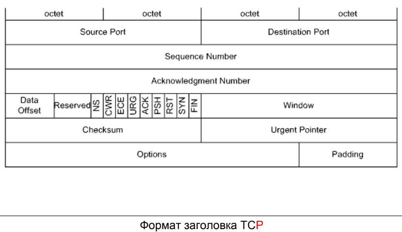

Структура заголовка TCP:
- Source Port – программный порт источника;
- Destination Port – программный порт назначения;
- Sequence Number (SN) – последовательный номер сегмента;
- Acknowledgment Number (AN) – подтверждающий номер;
- Data Offset – смещение данных;
- Reserved – зарезервировано (должно равняться нулю);
- URG – флаг значимости указателя на экстренные данные;
- ACK – флаг значимости подтверждающего номера;
- SYN – флаг синхронизации последовательных номеров;
- FIN – флаг последних данных;
- Window (W) – предлагаемое окно;
- Checksum – контрольная сумма;
- Urgent Pointer – указатель на экстренные данные;
- Options – опции (например, MSS);
- Padding – наполнитель.

# 53. Протокол TCP

Функционирование оконного механизма TCP базируется на использовании трех полей в заголовке сегмента: SN, AN, W и трех флагов: SYN, ACK, FIN.

Установление TCP-соединения, известное как «тройное рукопожатие» (three-way handshake), основывается на использовании флагов SYN и ACK.

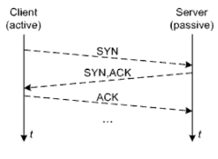

Алгоритм трехстороннего рукопожатия:
1. Сначала TCP-процесс - инициатор взаимодействия (на стороне клиента) отправляет служебный сегмент с установленным флагом SYN, тем самым сообщая о своих намерениях (первое «рукопожатие»).
2. Затем запрашиваемый TCP-процесс (на стороне сервера), если он согласен взаимодействовать, подтверждает это ответным служебным сегментом с двумя установленными флагами SYN и ACK (второе «рукопожатие»).
3. Наконец, инициатор отвечает еще одним служебным сегментом с установленным флагом ACK, тем самым подтверждая подтверждение (третье «рукопожатие»).

Хоть процесс установления соединения несимметричен, после его установления обмен данными может происходить в полнодуплексном режиме (т.е. в оба направления). 

Таким образом TCP-процесс, находящийся по одну сторону соединения, одновременно может быть как передатчиком данных, так и приемником.

Флаг SYN используется только при установлении соединения, а флаг ACK – в каждом ответном сегменте.

Поле SN пересылаемого сегмента отражает собственный SN этого сегмента, а поле AN указывает SN ожидаемого сегмента, коим является следующий по порядку сегмент.

После синхронизации SNs соединение считается установленным
(established).

Размер предлагаемого окна в поле W может изменяться каждый раз при посылке сегмента. Если W=0, то это расценивается как запрет на передачу данных.

TCP предоставляет гарантию доставки, которая реализуется через так называемые тайм-ауты.

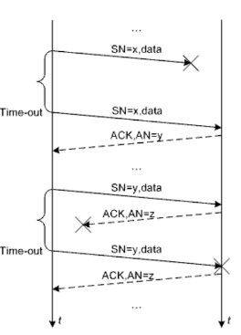

Передающий TCP-процесс определяет потерю сегмента с данными либо его подтверждения по отсутствию этого подтверждения в течение установленного интервала времени. После наступления тайм-аута сегмент с данными передается повторно. 

Отрицательные подтверждения не предусмотрены вообще. Принимающий TCP-процесс подтверждает все принятые сегменты с данными, причем подтверждает всегда. При этом если принята копия (что говорит о потере подтверждения), то она удаляется. Получение сегмента с SN больше ожидаемого говорит о возможной потере сегментов с данными или о разупорядочивании.

Флаг FIN используется для закрытия соединения с одной стороны. Если флаг FIN посылается только одной стороной, то соединения называют полу открытым. В таком состоянии сторона с закрытым соединением может только принимать данные и отправлять ACK, но не способно передавать данные.

# 54. Усовершенствования протокола TCP

Под синдромом глупого окна понимают несоответствие окна передачи с состоянием приемника, тем самым, не позволяя его либо нагрузить, либо разгрузить. 

Существует два решения:
- Нэгла - помогает при отправке небольших сегментов;
- Кларка - помогает в случаях, когда принимающая сторона имеет небольшое предлагаемое окно.

Для борьбы с перегрузками в СПД существует 4 решения:
- Медленный старт (подразумевает плавное увеличение размера окна, а не скачком);
- Избегание затора (подразумевает сдерживание экспоненциального роста размера текущего окна передачи после преодоления им некоторого порога, обычно применяется после медленного старта);
- Быстрая повторная передача (подразумевает уведомление принимающей стороной передающую о потере пакета, с последующей повторной отправкой потерянного пакета до истечения тайм-аута);

    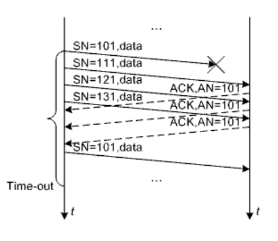

- Быстрое восстановление (подразумевает переход к избеганию затора после обнаружения оного, минуя медленный старт);

    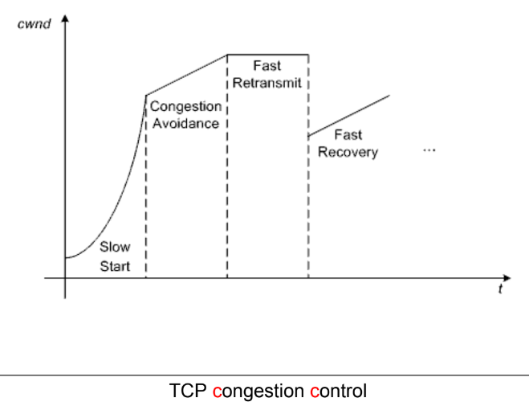

Последствия потерь и разупорядочивания сегментов заключаются в
разрушении «маятника» взаимодействия и приводят к необходимости еще одной важной оптимизации, четко проявляющейся при быстрой повторной передаче.

Согласно базовому алгоритму все сегменты должны быть подтверждены, а значит, после быстрой повторной передачи принимающая сторона должна послать все недостающие подтверждения.

Стороны могут «договориться», что текущий AN отражает номер первого ожидаемого получателем сегмента плюс автоматически подтверждает все сегменты с меньшими номерами (cumulative acknowlegement).

# 55. Протокол UDP и заголовок UDP

Протокол транспортного уровня _UDP (User Datagram Protocol, RFC 768)_ реализует способ пересылки данных без гарантии доставки, часто называемый дейтаграммным (datagram, хотя user datagram - это пакет с контролируемыми пользователем данными, а datagram - это любой пакет c данными).

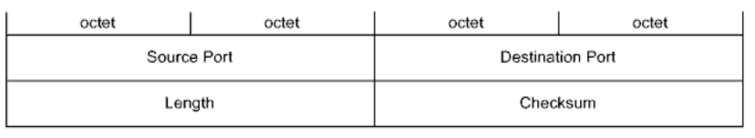

Структура заголовка UDP:
- Source Port – программный порт источника;
- Destination Port – программный порт назначения;
- Length – длина датаграммы включая заголовок (в байтах);
- Checksum – контрольная сумма (псевдозаголовка + заголовка + данных).

При вкладывании UDP-дейтаграммы в IP пакет, между ними вставляется UDP-псевдозаголовок, дублирующий некоторые поля из основного IP заголовка.

# 56. Классификация и характеристики сред передачи данных

Все основные в КС СрПД можно разделить на пять типов:
- Коаксиальные кабели;
- Кабели на основе витых пар;
- Оптоволоконные кабели;
- Эфир;
- Телефонные пары.

По области применения кабели делят на:
- Кабели для внешней прокладки (СПД на улице);
- Кабели для внутренней прокладки (СПД в помещениях);
- Оконечные кабели (для подключения рабочих мест).

К кабелям внешней прокладки выдвигают больше требований, чем к кабелям внутренней.

Многие сведения о характеристиках кабеля производители указывают на изоляции.

В простейшем случае отдельный провод состоит из физического
проводника (conductor) и изоляции (isolation).

Проводники могут быть одножильными (solid) и многожильными(stranded).

Отдельно выделяют так называемые витые (twisted) провода. Обычно свиты два провода, образующие дифференциальную пару.

Традиционно кабели измеряют метрами или футами (1 ft = 30,48 sm). 

Сечение проводников, используемых в КС (и не только), принято измерять в AWG (American Wire Gauge): диаметр 1 mm соответствует 18 AWG (сечение 0,78 mm 2; максимальный ток 2,36 A - при максимально допустимой плотности тока 3 A/mm 2).
Например, стандартное сечение жилы витой пары равно 24 AWG
(диаметр около 0,5 mm).

# 57. Среды передачи данных на основе коаксиальных кабелей

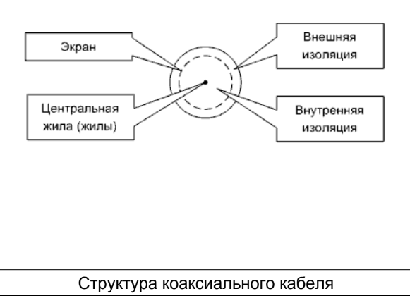

Для формирования сегмента на базе коаксиального кабеля необходимо соответствующее количество BNC-разъемов (для подключения к рабочей станции), T-соединителей (для вывода кабеля в сторону рабочей станции) и пара терминаторов (на концах кабеля), один из которых заземляют.

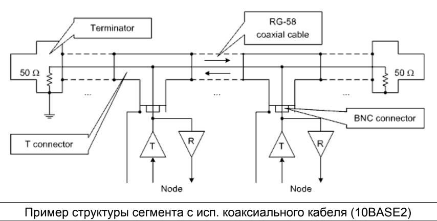

Коаксиальные кабели выпускаются черными, реже серыми.

# 58. Среды передачи данных на основе витой пары

Выделяют 4 вида витых пар.

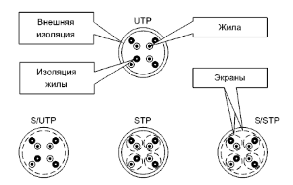

Где TP – Twisted Pair, S – Shielded, U – Unshielded + может быть F – Foiled (если для изготовления экрана применена фольга)

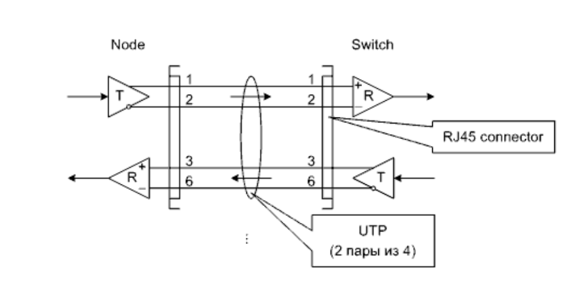

Обычно витыми парами соединяют разноранговое сетевое оборудование (например, пользовательскую станцию подключают к коммутатору). Если надо подключить одноранговые устройства (например, две станции пользователя) используют кросс-кабели.

Для подключения кабелей на основе витых пар применяют разъемы RJ45.

У нас принято такое расположение проводов в штекере (568-B):

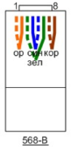

Обычные кабели имеют серый цвет, другие цвета (оранжевый, белый) говорят о более высоком качестве (например, по пожарной безопасности).

## 59. Среды передачи данных на основе оптоволоконных кабелей

Рабочим компонентом оптоволоконных кабелей являются световоды, изготовленные из оптоволокна, т.е. особого кварцевого стекла.

Так как оптоволокно очень хрупкое, его многократно защищают различными способами. 

Световод - это оптический волновод.

Рабочими компонентами самого световода являются оболочка (cladding) и сердцевина (core).

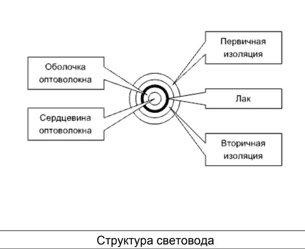

В стандартах предусмотрены 8 базовых видов световодов: OM1, OM2, OM3, OM4, OM5, OS1, OS1a, OS2.

Отличаются полосой пропускания и другими техническими характеристиками.

 Дополнительно оптоволоконные кабели делят на два типа:
- Содержащие упрочняющие металлизированные конструкции или проводники;
- Полностью диэлектрические.

Оптоволоконные соединения выполняют двумя способами:
1. Разъемным, причем может быть:
    - контактным;
    - линзовым.
2. Неразъемным, причем может быть:
    - сплавным;
    - механическим.


Оптоволоконные соединения выполняют двумя способами:
- Разъемным;
- Неразъемным.

## 60. Физический уровень Ethernet

Ключевые стандарты, описывающие физический уровень Ethernet:
<!--кроме стандартов в лекциях про это ни слова-->

- 10BASE5 (1983) - «толстый» (thick) коаксиальный кабель 50Ω (до 500 m) плюс внешние приемопередатчики;
- 10BASE2 (802.3a, 1985) - «тонкий» (thin) коаксиальный кабель 50 Ω (до 185 m) плюс интегрированные приемопередатчики;
- 10BASE-T (802.3i, 1990) - две телефонные витые пары (до 100 m); 
- 10BASE-FL (802.3j, 1993) - два многорежимных световода (до 500 m) плюс нечетко регламентированные источники излучения (обычно LEDs);
- 100BASE-TX (802.3u, 1995) - две неэкранированные либо экранированные витые пары категории 5 (до 100 m);
- 100BASE-FX (802.3u, 1995) - два многорежимных световода (до 2 km) (реализации поддерживают и однорежимные световоды длиной десятки километров) плюс нечетко регламентированные источники излучения (реализации поддерживают LEDs и лазеры);
- 1000BASE-SX (802.3z, 1998) - два многорежимных световода (до 275 m -- 62,5 um, до 550 m - 50 um) плюс коротковолновые (short wavelength) лазеры (770 - 860 nm);
- 1000BASE-LX (802.3z, 1998) - два однорежимных (до 5 km) либо многорежимных световода (до 550 m) плюс длинноволновые (long wavelength) лазеры (1270 - 1355 nm);
- 1000BASE-T (802.3ab, 1999) -- четыре неэкранированные либо экранированные витые пары категории 5 (до 100 m);
- 2.5GBASE-T (802.3bz, 2016) - четыре неэкранированные либо экранированные витые пары категории 5e (расстояние до 100 m);
- 5GBASE-T (802.3bz, 2016) - четыре неэкранированные либо экранированные витые пары категории 5e (расстояние до 100 m);
- 10GBASE-SR (802.3ae, 2002) - два многорежимных световода (до 33 m - 62,5 um, до 400 m - 50 um) плюс коротковолновые лазеры (840 - 860 nm);
- 10GBASE-LR (802.3ae, 2002) - два однорежимных световода (до 10 km) плюс длинноволновые лазеры (1310 nm);
- 10GBASE-ER (802.3ae, 2002) - два однорежимных световода (до 30 km) плюс экстрадлинноволновые (extra long wavelength) лазеры (1550 nm);
- 10GBASE-T (802.3an, 2006) - четыре неэкранированные (до 55 m) либо экранированные (до 100 m) витые пары категории 6, либо четыре неэкранированные либо экранированные витые пары категории 6A (до 100 m).

## 61. Структурированные кабельные системы и их модели

Структурированная кабельная система – упорядоченная совокупность телекоммуникационных и силовых кабелей, различного сетевого оборудования, а также соответствующих специализированных помещений.

Основой для построения любой СКС является древовидная топология,
узлами которой служит сетевое оборудование определенного типа
(distributors).

В связи с этим, технические помещения СКС (так же distributors) делят на два типа:
1. Кроссовые (telecommunications rooms).
2. Аппаратные (equipment rooms).
Аппаратные отличаются от кроссовых тем, что в них, наряду с активным, пассивным, монтажным и вспомогательным сетевым оборудованием, может быть размещено серверное оборудование.

СКС включает в себя три подсистемы:
- Подсистема внешних магистралей - организация связи между зданиями на небольшой территории;
- Подсистема внутренних магистралей или вертикальная - связывает между собой этажи одного здания;
- Горизонтальная подсистема - связывает между собой оборудование в пределах этажа.

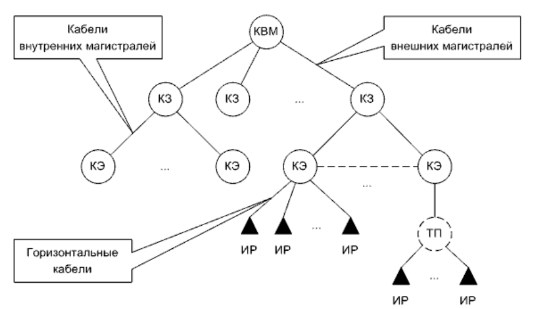

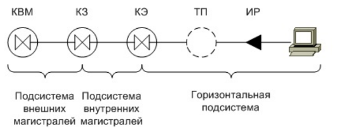

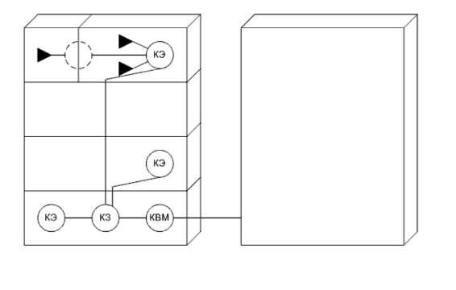

где:
- КВМ – кроссовая внешних магистралей;
- КЗ – кроссовая здания;
- КЭ – кроссовая этажа;
- ТП – точка перехода;
- ИР – информационная розетка рабочего места.

## 62. Питание и заземление в структурированных кабельных системах

Заземление необходимо для:
- Предотвращения удара током людей;
- Защиты кабелей и сетевого оборудования от выхода из строя и помех;
- Обеспечения возможности прохождения сигналов применительно к некоторым видам сетевого оборудования.

Согласно стандарту TIA-607, в дополнение к основному контуру заземления здания либо сооружения, создают так называемый телекоммуникационный контур заземления.

Рекомендации стандартов по заземлению экранов кабелей:
- В аппаратных и кроссовых экраны должны заземляться по возможности на телекоммуникационный контур;
- Экраны вертикальной подсистемы должны заземляться с обоих концов;
- Экраны горизонтальной подсистемы достаточно заземлять с одного конца.

Для защиты от электрических разрядов в атмосфере (особенно вертикальной подсистемы) применяют специальные устройства - грозоразрядники (lightning gaps).

## 63. Пожарная безопасность структурированных кабельных систем

Существует 4 уровня классификации кабелей относительно пожарной безопасности:
- Plenum – кабели для прокладки в plenum-полостях (есть приток воздуха, для постоянного горения);
- Riser – кабели для прокладки в кабельных шахтах;
- General purpose – кабели для прокладки где угодно, кроме plenum-полостей и кабельных шахт;
- Residential – кабели на прокладку которых наложены ограничения (например, только для жилых помещений).

В состав маркировок кабелей часто входят буквенные обозначения материалов оболочек:
- PVC (PolyVinyl Chloride) – ПВХ;
- PE (PolyEthylene) – полиэтилен;
- PA (PolyAmide) – полиамид (нейлон);
- FR (Flame Retardant) – огнестойкий;
- LS (Low Smoke) – низкое выделение дыма при горении;
- NC (None Corrosive) – не подвержен коррозии;
- UVR (Ultra Violet Resistant) – не подвержен влиянию ультрафиолетового излучения;
- HF (Halogen Free) – не содержит галогенов.

## 64. Технология PoE

PoE (Power over Ethernet) – технологии, задачей которых является предоставления способа запитки маломощных Ethernet устройств через информационные кабели (на основе витых пар).

Существует два соответствующих стандарта: 802.3af и 802.3at, однако множество производителей используют свои проприетарные технологии.

В структуру PoE-системы входят:
- PSE (Power Sourcing Equipment) – вводит питающее напряжение в кабель;
- PD (Power Device) – питается от напряжения.

PSE может располагаться либо на конце кабеля, либо вклиниваться в кабель (PoE-инжектор).

Иногда PoE используется и для запитывания «небольших» PD, PoE не поддерживающих, со стороны PD в кабель «вклинивается» PoE-DC- адаптер.

## 65. Структура системы FTP

FTP (File Transfer Protocol) – протокол прикладного уровня, предназначенный для пересылки файлов между двумя удаленными станциями. Базируется на клиент-серверной модели и использует транспорт TCP.

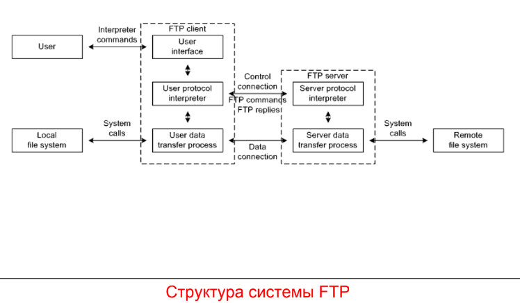

FTP-клиент обслуживает запросы пользователя и работает на локальной по отношению к пользователю станции.

На рисунке показана взаимосвязь между одним FTP-клиентом и одним FTP-сервером, но возможна также схема взаимодействия когда по инициативе FTP-клиента осуществляется файловый обмен между двумя FTP-серверами.

FTP-сервер обслуживает запросы FTP-клиента и работает на удаленной станции.

Выделяют протокольные интерпретаторы и процессы пересылки данных.

FTP-сервер представляет собой непрерывно выполняющуюся программу, ожидающую запросы от FTP-клиентов, выраженную в виде демона UNIX либо сервиса Windows.

В ОС UNIX работа демонов обычно контролируется конфигурационными файлами, а в Windows - соответствующими оконными средствами.

FTP задействует два соединения, а значит и два порта:
- 20 – FTP Data – информационное соединение;
- 21 – FTP – управляющее соединение.

В некоторых особых ситуациях может происходить отказ от использования стандартных портов.

## 66. Протокол FTP и режимы обмена по протоколу FTP

Взаимодействие по протоколу FTP базируется на модели запрос-ответ с применением тайм-аутов.

FTP-команда представляет из себя последовательность из 3-4 букв (регистр не учитывается), за которыми могут следовать аргументы, разделяемые пробелом `<SP>`. Команда завершается символами возврата каретки и перевода строки `<CRLF>`.

Некоторые команды протокола FTP:
- USER `<username>` - имя пользователя;
- PASS `<password>` - пароль, должна следовать после USER;
- CWD `<pathname>` - сменить рабочий каталог удаленной ФС;
- CDUP – перейти к родительскому каталогу;
- QUIT – выход из удаленной системы;
- PORT `<host-port>` - Совокупность IP-адреса и номера порта, необходимая для создания data connection (`<h1>`,`<h2>`, `<h3>`,`<h4>`,`<p1>`,`<p2>`);
- PASV – установить пассивный режим обмена;
- TYPE `<typecode>` - файловое представление;
- RETR `<pathname>` - загрузить файл с FTP-сервера (download);
- STOR `<pathname>` - загрузить файл на FTP-сервер (upload), если файл с таким названием уже есть, то перезаписать;
- APPE `<pathname>` - загрузить файл на FTP-сервер (upload), если файл с таким названием уже есть, то данные дописываются в конец;
- DELE `<pathname>` - удалить файл или каталог на FTP-сервере;
- RMD `<pathname>` - удалить каталог на FTP-сервере;
- MKD `<pathname>` - создать каталог на FTP-сервере;
- PWD – вывести на экран рабочий каталог;
- LIST `[<pathname>]` – вывести список файлов удаленного каталога.

Каждый FTP-запрос должен сопровождаться как минимум одним FTP-ответом.

FTP-ответ кодируется так:

$$xyz, SP, text, CRLF$$

где $xyz$ – целочисленный трехбайтный код.

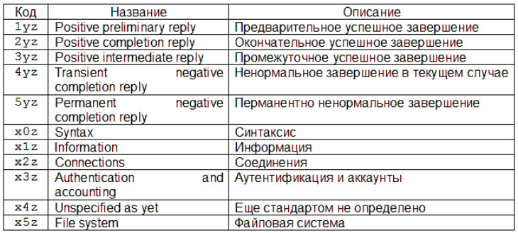

В зависимости от того, какая сторона является инициатором установления информационного соединения различают активный и пассивный режимы обмена. Активный режим более предпочтителен.

Отличие активного и пассивного режимов заключается в том, как создается информационное соединение: в активном режиме это происходит через команду `PORT <p>` от клиента к серверу, где $p$ - динамически выделенный порт клиента, $p \leftrightarrow 20$;

В пассивном режиме клиент отправляет команду `PASV`, ответом на которую является динамически выделенный порт сервера $p2$, после чего выделяется динамический порт клиента $p1$ и происходит создание связи $p1 \leftrightarrow p2$.

Файловое представление (data type, representation type) необходимо для согласования файловых систем передающей и принимающей сторон.

FTP поддерживает четыре основных файловых представления:
1. ASCII - файл считается текстовым и пересылается в 7-мибитной
кодировке NVT-ASCII (по умолчанию).
2. EBCDIC - файл считается текстовым и пересылается в 8-мибитной
кодировке EBCDIC фирмы IBM.
3. Image - файл считается бинарным и пересылается упакованным в 8-мибитные байты.
4. Local byte size - файл считается состоящим из неделимых байтов соответствующего размера (должен быть задан) и пересылается с учетом этого (если размер байта не кратен октету, то возникает автодополнение).

Дополнение к файловому представлению, в FTP предусмотрена
возможность структурировать файл при его пересылке по информационному соединению (data structure).

Поддерживаются три структуры:

1. File structure - файл не имеет внутренней структуры и рассматривается как непрерывный поток байтов (по умолчанию).
2. Record structure - файл рассматривается как последовательность записей, структура приемлема только для текстовых файлов.
3. Page structure - файл имеет страничную организацию, каждая страница имеет заголовок и индексацию, структура зависит от реализации.

Наконец, существует возможность установить режим пересылки (transmission mode).

Возможны три режима:

1. Stream - файл пересылается как непрерывный поток байтов (по
умолчанию); если файл не имеет внутренней структуры, то прием
метасимвола `<EOF>` означает, что пересылка окончена; для случаев со сложной структурой предусмотрены специальные коды для `<EOR>` и `<EOF>`.
2. Block - файл пересылается в виде последовательности блоков,
каждый из которых имеет заголовок, в котором записываются счетчик байтов и специальные коды; способ поддерживается редко.
3. Compressed - файл пересылается в сжатом простейшими алгоритмами виде; способ поддерживается редко.

В зависимости от того, какая из взаимодействующих сторон является инициатором установления информационного соединения различают активный и пассивный режимы обмена (data transfer process modes).

При этом направление пересылки файлов, то есть какая из сторон является отправителем, а какая получателем, значения не имеет.

Активный режим является рекомендуемым и наиболее используемым.

В активном режиме управляющее соединение создается следующим образом. FTP-клиент, используя динамически выделенный порт (с номером больше 1024), создает управляющее соединение с портом 21 FTP-сервера.

Затем FTP-клиент динамически выделяет еще один порт и посылает его номер FTP-серверу с помощью FTP-команды PORT.

Затем FTP-сервер создает информационное соединение с указанным портом, со своей стороны используя порт 20.

Если FTP-клиент не передал команду PORT, что в крайней степени не рекомендуется, то FTP-сервер создает информационное соединение с тем же самым портом FTP-клиента, который используется управляющим соединением.

Пассивный режим обычно устанавливается принудительно.

В пассивном режиме FTP-клиент создает как управляющее, так и информационное соединения с FTP-сервером.

После того, как аналогичным образом создано управляющее соединение FTP-клиент передает FTP-команду PASV FTP-серверу.

Получив ее, FTP-сервер динамически выделяет порт для информационного соединения и передает его номер FTP-клиенту с помощью FTP-ответа 227.

Затем FTP-клиент динамически выделяет еще один порт и создает информационное соединение с портом, номер которого получил от FTP- сервера.

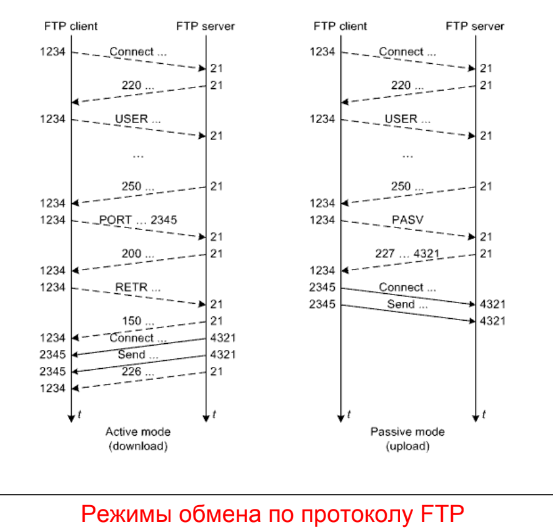

---

# 1. Инкапсуляция, туннелирование и фрагментация в компьютерных сетях (примеры)

См. 20 теоретический вопрос.

## Инкапсуляция

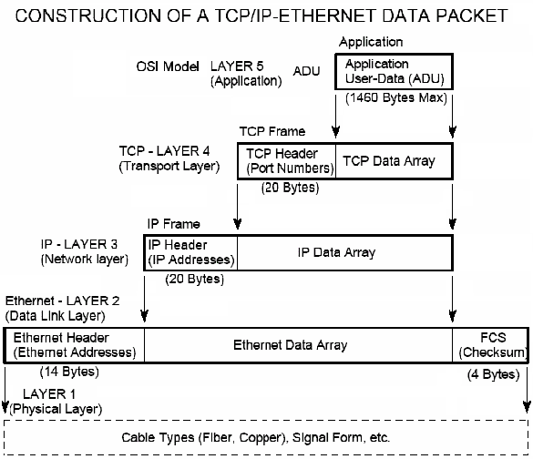

## Туннелирование

Примеры туннелирования:

 - VPN (виртуальная частная сеть): Туннелирование используется для создания шифрованного туннеля через общедоступную сеть, что позволяет удаленным пользователям безопасно подключаться к корпоративным сетям.

 - HTTP/SSL туннели: Этот тип туннелирования позволяет зашифровать данные, передаваемые через протокол HTTP, с использованием протокола SSL, обеспечивающего безопасную передачу информации через Интернет.

 - Туннелирование IPv6 через IPv4: Этот вид туннелирования используется для передачи трафика IPv6 через сети, которые поддерживают только IPv4.

- SSH туннель: SSH (Secure Shell) туннель позволяет безопасно передавать данные между удаленными устройствами, обеспечивая шифрование и аутентификацию.

## Фрагментация

Например, если компьютер A отправляет большой IP-пакет размером 1500 байтов, а промежуточный маршрутизатор имеет ограничение MTU 1000 байтов, то этот пакет будет фрагментирован на два фрагмента: первый будет содержать 1000 байтов данных, а второй - оставшиеся 500. Эти фрагменты будут отправлены через сеть и повторно собраны на конечном узле.

# 2. Алгоритмы бит-стаффинга и байт-стаффинга (схемы и алгоритмы)

См. 20-21 теоретические вопросы.

Пошаговый алгоритм бит-стаффинга:
0. Входные данные: последовательность битов;
1. Начало;
2. Инициализация счетчика битов C = 0;
3. Пока не достигнут конец последовательности;
4. Берём 7 битов из последовательности и сравниваем их с 7 битами флага;
5. Если флаг совпал с взятой последовательностью вставляем 1;
6. Увеличить индекс текущего бита;
7. Конец.

Схема бит-стаффинга вариант 1:

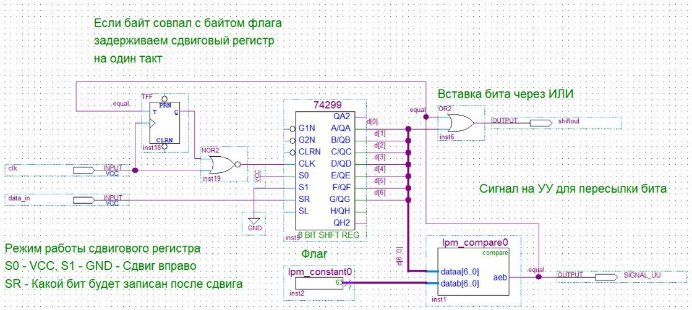

Схема бит-стаффинга вариант 2:

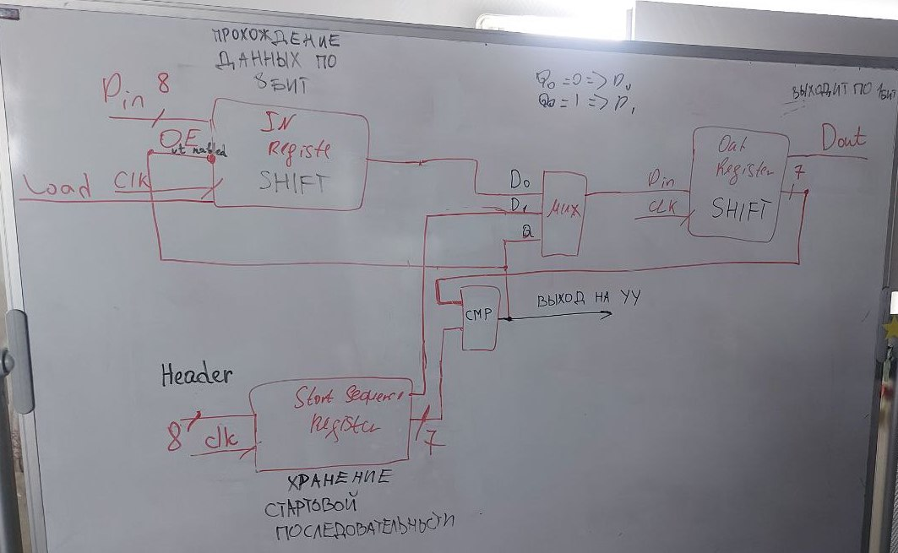

Пошаговый алгоритм байт-стаффинга:
0. Входные данные: последовательность байтов для передачи;
1. Начало;
2. Проход по каждому байту в последовательности;
3. Если встречается определенная последовательность байтов, то вставить специальный управляющий байт перед этой последовательностью;
4. Продолжение прохода по всей последовательности байтов;
5. Конец.

# 3. Линейные коды (кодирование)

См. 24-26 теоретические вопросы.

# 4. Помехоустойчивые коды (расчеты)

Расстоянием Хемминга между двумя кодовыми словами $c_1$ и $c_2$ называется количество отличных бит на соответствующих позициях, то есть число «единиц» в векторе $(c_1 \oplus c_2)$:

Минимальное расстояние $d_{min}$ линейного кода равно минимальному из весов Хемминга ненулевых кодовых слов:
```math
d_{min} = min(w(c_i)).
```

_Примечание. Доказательство следует из свойства линейности разности векторов линейного кода_.

Исправляющая способность кода:
```math
t = \left\lfloor\dfrac{d_{min} - 1}{2}\right\rfloor.
```

Обнаруживающая способность кода:
```math
f = d_{min} - 1.
```

# 5. Код Хэмминга и циклический код (кодирование)

## 5.1. Код Хэмминга (7;4)

Код Хэмминга $(7;4)$ представляет собой систематический линейный код, сопоставляющий 4-разрядному слову 7-разрядное кодовое слово вида:

```math
(i_1, i_2, i_3, i_4, r_1, r_2, r_3),
```

где $r_n$ - проверочные биты:

- $r_1 = i_1 \oplus i_2 \oplus i_3$,
- $r_2 = i_2 \oplus i_3 \oplus i_4$,
- $r_3 = i_1 \oplus i_2 \oplus i_4$.

Получение кодового слова выглядит следующим образом:
```math
(i_1\;i_2\;i_3\;i_4) \cdot 

\begin{pmatrix}
    1 & 0 & 0 & 0 & 1 & 0 & 1 \\
    0 & 1 & 0 & 0 & 1 & 1 & 1 \\
    0 & 0 & 1 & 0 & 1 & 1 & 0 \\
    0 & 0 & 0 & 1 & 0 & 1 & 1 \\
\end{pmatrix}

= (i_1\;i_2\;i_3\;i_4\;r_1\;r_2\;r_3).
```

На вход декодера поступает кодовое слово:
```math
v = (i_1^\prime\;i_2^\prime\;i_3^\prime\;i_4^\prime\;r_1^\prime\;r_2^\prime\;r_3^\prime),
```

где $c^\prime$ - символ, который может содержать ошибку.

Декодер строит последовательность синдромов:
```math
S_1 = i_1 \oplus i_2 \oplus i_3, \\
S_2 = i_2 \oplus i_3 \oplus i_4, \\
S_3 = i_1 \oplus i_2 \oplus i_4.
```

где $S = (S_1\;S_2\;S_3)$ - синдром принятой последовательности.

Получение синдрома выглядит следующим образом:
```math
(i_1\;i_2\;i_3\;i_4\;r_1\;r_2\;r_3) \cdot 

\begin{pmatrix}
    1 & 0 & 1 \\
    1 & 1 & 1 \\
    1 & 1 & 0 \\
    0 & 1 & 1 \\
    1 & 0 & 0 \\
    0 & 1 & 0 \\
    0 & 0 & 1 \\
\end{pmatrix}

= (S_1\;S_2\;S_3).
```

Исправление ошибки происходит согласно таблице соответствия синдрома:

| Синдром         | Маска искажений | Ошибка |
|-----------------|-----------------|--------|
| 000             | 0000000         |        |
| 001             | 000000**1**     | $r_3$  |
| 010             | 00000**1**0     | $r_2$  |
| 011             | 000**1**000     | $i_4$  |
| 100             | 0000**1**00     | $r_1$  |
| 101             | **1**000000     | $i_1$  |
| 110             | 00**1**0000     | $i_3$  |
| 111             | 0**1**00000     | $i_2$  |

## 5.2. Циклический код (n;k)

Циклический код $(n;k)$ представляет собой линейный блочный код, обладающий свойством цикличности, сопоставляющий k-разрядному слову n-разрядное кодовое слово.

Возможно кодирование с применением матричного и полиномиального представления.

Существует две теоремы:

- Если $C$ - циклический код $(n; k)$, $g(x)$ - его порождающий полином, то степень $g(x) = r = n - k$, и каждое кодовое слово может быть единственным образом представлено как $c(x) = m(x) \cdot g(x)$.

- Порождающий полином $g(x)$ циклического $(n; k)$ кода является делителем двучлена $(x^n - 1)$.

Таким образом, в качестве порождающего полинома можно выбирать любой полином делитель $(x^n - 1)$. 

Степень выбранного полинома будет определять количество проверочных символов $r$, число информационных символов $k = n − r$.

### 5.2.1. Несистематическое кодирование

При несистематическом кодировании кодовое слово получается в виде произведения информационного полинома на порождающий:
```math
c(x) = m(x) \cdot g(x).
```

Определение синдрома выполняется посредством остаточного деления принятого кодового слова на образующий полином.

### 5.2.2. Систематическое кодирование

При систематическом кодировании кодовое слово формируется в виде информационного подблока и проверочного:
```math
c(x) = [m(x)\;|\;p(x)].
```

Пусть информационное слово образует старшие степени кодового слова, тогда:
```math
c(x) = x^r\cdot m(x) + p(x),\;r = n - k,
```

где 
```math
p(x) = x^r\cdot m(x)\;\;mod\;\;g(x).
```

# 6. Поля Галуа (математические операции)

Теория (см. вопрос 27)

Предположим, что в задании требуется определить операции сложения и умножения над полем Галуа $$GF(2^3)$$

Возьмем следующее выражение за неприводимый полином третьей степени

$$f(x) = x^3 + x^2 + 1$$

При сложении двух элементов полинома с одинаковыми степенями мы можем получить коэффициент 2, но поскольку система счисления двоичная, то коэффициент получится 0.

Пример сложения двух полиномов:

$$f(x)=x^3+x^2+x+1$$

$$g(x)=x^2+x$$

$$f(x)+g(x)=x^3+x^2+x+1 + x^2+x = x^3+\cancel{x^2}+\cancel{x}+1 + \cancel{x^2}+\cancel{x} = x^3+1$$

При умножении полиномов возникает неоднозначная ситуация, если умножать их обычным способом, то результат может выйти за пределы поля. Поэтому операция умножения полиномов в данном случае определена как взятие остатка от деления полиномов. Существует как минимум два варианта нахождения остатка полинома: обычное умножение полинома и нахождение остатка с помощью деления на порождающий полином или представление полинома как:
$f(x)=q(x) \times g(x) + r(x)$

Примеры умножения двух полиномов

 - Пример 1. $g(x)$ - первый множитель, $m(x)$ - второй множитель, $f(x)$ - порождающий полином 3 степени

$$f(x)=x^3+x^2+1$$

$$g(x)=x^2+x$$

$$m(x)=x^2+x+1$$

$$g(x) \times m(x) = x^4 + 2x^3 + 2x^2 + x = x^4 + x$$

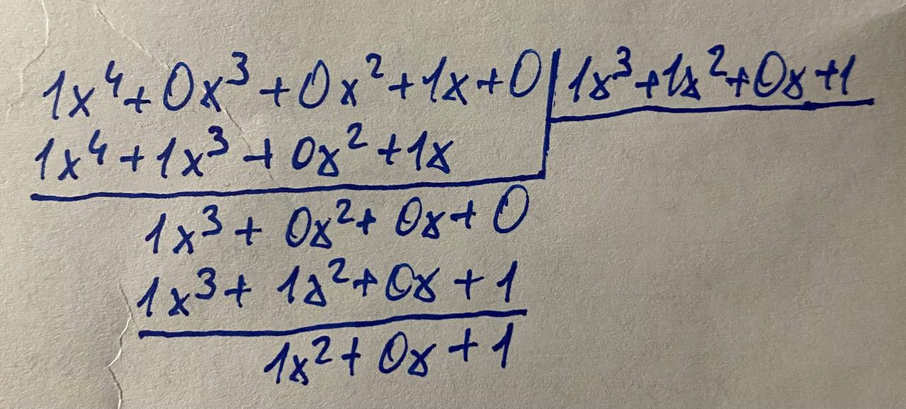

$$f(x) \times g(x) = \underline{x^2 + 1}$$

 - Пример 2

$$f(x)=x^3+x^2+1$$

$$g(x)=x^2+x$$

$$m(x)=x^2+x+1$$

$$m(x) \times g(x) = (x^2+x+1) \times (x^2+x) = x^4 + x$$

$$x^4+x = q(x)f(x) + r(x)$$

Здесь $q(x)$ некоторый множитель, который нужно подобрать, а $r(x)$ соответственно остаток.

$$x^4+x = (x+1)(x^3+x^2+1) + r(x) = (x^4+x^2+x+1) + \underline{(x^2 + 1)}$$

Первая строка таблицы показывает, какие элементы присутствуют в поле (от 0 до 7, всего 8 элементов, что очевидно). Сами же таблицы являются результатами выполнения операций над каждым элементом поля. Каждый элемент представлен в виде полинома.

| $+$       | <re>$0$</re>       | <ye>$1$</ye>       | <or>$x$</or>       | <gr>$x+1$</gr>     | <bl>$x^2$</bl>     | <pu>$x^2+1$</pu>   | <fu>$x^2+x$</fu>   | <aq>$x^2+x+1$</aq> |
| :---------:      | :---------:      | :---------:      | :---------:      | :---------:      | :---------:      | :---------:      | :---------:      | :---------:      |
| <re>$0$</re>       | <re>$0$</re>       | <ye>$1$</ye>       | <or>$x$</or>       | <gr>$x+1$</gr>     | <bl>$x^2$</bl>     | <pu>$x^2+1$</pu>   | <fu>$x^2+x$</fu>   | <aq>$x^2+x+1$</aq> |
| <ye>$1$</ye>       | <ye>$1$</ye>       | <re>$0$</re>       | <gr>$x+1$</gr>     | <or>$x$</or>       | <pu>$x^2+1$</pu>   | <bl>$x^2$</bl>     | <aq>$x^2+x+1$</aq> | <fu>$x^2+x$</fu>   |
| <or>$x$</or>       | <or>$x$</or>       | <gr>$x+1$</gr>     | <re>$0$</re>       | <ye>$1$</ye>       | <fu>$x^2+x$</fu>   | <aq>$x^2+x+1$</aq> | <bl>$x^2$</bl>     | <pu>$x^2+1$</pu>   |
| <gr>$x+1$</gr>     | <gr>$x+1$</gr>     | <or>$x$</or>       | <ye>$1$</ye>       | <re>$0$</re>       | <aq>$x^2+x+1$</aq> | <fu>$x^2+x$</fu>   | <pu>$x^2+1$</pu>   | <bl>$x^2$</bl>     |
| <bl>$x^2$</bl>     | <bl>$x^2$</bl>     | <pu>$x^2+1$</pu>   | <fu>$x^2+x$</fu>   | <aq>$x^2+x+1$</aq> | <re>$0$</re>       | <ye>$1$</ye>       | <or>$x$</or>       | <gr>$x+1$</gr>     |
| <pu>$x^2+1$</pu>   | <pu>$x^2+1$</pu>   | <bl>$x^2$</bl>     | <aq>$x^2+x+1$</aq> | <fu>$x^2+x$</fu>   | <ye>$1$</ye>       | <re>$0$</re>       | <gr>$x+1$</gr>     | <or>$x$</or>       |
| <fu>$x^2+x$</fu>   | <fu>$x^2+x$</fu>   | <aq>$x^2+x+1$</aq> | <bl>$x^2$</bl>     | <pu>$x^2+1$</pu>   | <or>$x$</or>       | <gr>$x+1$</gr>     | <re>$0$</re>       | <ye>$1$</ye>       |
| <aq>$x^2+x+1$</aq> | <aq>$x^2+x+1$</aq> | <fu>$x^2+x$</fu>   | <pu>$x^2+1$</pu>   | <bl>$x^2$</bl>     | <gr>$x+1$</gr>     | <or>$x$</or>       | <ye>$1$</ye>       | <re>$0$</re>       |

| $\times$              | <re>$0$</re>       | <ye>$1$</ye>       | <or>$x$</or>       | <gr>$x+1$</gr>     | <bl>$x^2$</bl>     | <pu>$x^2+1$</pu>   | <fu>$x^2+x$</fu>   | <aq>$x^2+x+1$</aq> |
| :---------:      | :---------:        | :---------:        | :---------:        | :---------:        | :---------:        | :---------:        | :---------:        | :---------:        |
| <re>$0$</re>       | <re>$0$</re>       | <re>$0$</re>       | <re>$0$</re>       | <re>$0$</re>       | <re>$0$</re>       | <re>$0$</re>       | <re>$0$</re>       | <re>$0$</re>       |
| <ye>$1$</ye>       | <re>$0$</re>       | <ye>$1$</ye>       | <or>$x$</or>       | <gr>$x+1$</gr>     | <bl>$x^2$</bl>     | <pu>$x^2+1$</pu>   | <fu>$x^2+x$</fu>   | <aq>$x^2+x+1$</aq> |
| <or>$x$</or>       | <re>$0$</re>       | <or>$x$</or>       | <bl>$x^2$</bl>     | <fu>$x^2+x$</fu>   | <pu>$x^2+1$</pu>   | <aq>$x^2+x+1$</aq> | <ye>$1$</ye>       | <gr>$x+1$</gr>     |
| <gr>$x+1$</gr>     | <re>$0$</re>       | <gr>$x+1$</gr>     | <fu>$x^2+x$</fu>   | <pu>$x^2+1$</pu>   | <ye>$1$</ye>       | <or>$x$</or>       | <aq>$x^2+x+1$</aq> | <bl>$x^2$</bl>     |
| <bl>$x^2$</bl>     | <re>$0$</re>       | <bl>$x^2$</bl>     | <pu>$x^2+1$</pu>   | <ye>$1$</ye>       | <aq>$x^2+x+1$</aq> | <gr>$x+1$</gr>     | <or>$x$</or>       | <fu>$x^2+x$</fu>   |
| <pu>$x^2+1$</pu>   | <re>$0$</re>       | <pu>$x^2+1$</pu>   | <aq>$x^2+x+1$</aq> | <or>$x$</or>       | <gr>$x+1$</gr>     | <fu>$x^2+x$</fu>   | <bl>$x^2$</bl>     | <ye>$1$</ye>       |
| <fu>$x^2+x$</fu>   | <re>$0$</re>       | <fu>$x^2+x$</fu>   | <ye>$1$</ye>       | <aq>$x^2+x+1$</aq> | <or>$x$</or>       | <bl>$x^2$</bl>     | <gr>$x+1$</gr>     | <pu>$x^2+1$</pu>   |
| <aq>$x^2+x+1$</aq> | <re>$0$</re>       | <aq>$x^2+x+1$</aq> | <gr>$x+1$</gr>     | <bl>$x^2$</bl>     | <fu>$x^2+x$</fu>   | <ye>$1$</ye>       | <pu>$x^2+1$</pu>   | <or>$x$</or>       |

В таблице могут быть ошибки, поэтому не советую опираться на них.

# 7. Адресация в компьютерных сетях (примеры)

<!-- TODO: сделать это -->

# 8. TCP (диаграммы и взаимодействия с детализацией до SYN, ACK, FIN, SN, AN, W и Data) slow start, >1 сегмента, потеря сегмента

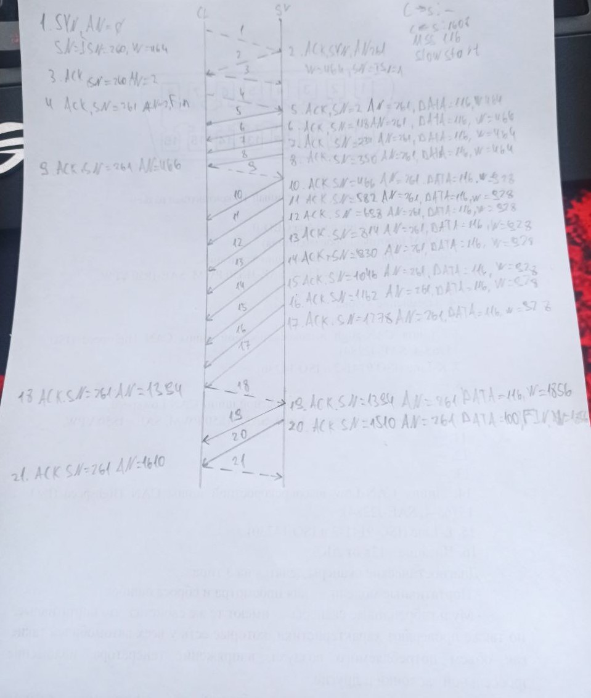

## 8.1. Медленный старт (slow start).

Идея заключается в том, что в начале передачи размер текущего окна передачи нужно увеличивать не «скачком», а плавно, пропорционально скорости получения подтверждений (не превышая размер предлагаемого окна).

Рекомендуемые формулы:
```math
IW = 2 * SMSS,\;если\;SMSS > 2190\;Bytes,
```
```math
IW = 3 * SMSS,\;если\;2190\;Bytes >= SMSS > 1095\;Bytes,
```
```math
IW = 4 * SMSS,\;если\;SMSS <= 1095\;Bytes,
```
где $IW$ (initial window) - начальное значение текущего окна передачи:

$$cwnd \mathrel{+}= min(N, SMSS) ,$$

где $cwnd$ (congestion window) - текущее окно передачи (в данном случае,окно затора), N - количество подтвержденных байтов, $SMSS$ (sender MSS) - $MSS$ передатчика.

## 8.2. Потеря сегмента

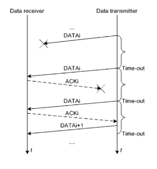

Ограничение ожидания во времени достигается за счет применения тайм-аута (time-out).

После передачи некоторого служебного или информационного пакета, требующего подтверждения, запускается таймер с обратным отсчетом. 

Если в течение заданного интервала времени соответствующая квитанция не приходит, то пакет считается утерянным и передается повторно (retransmission).

Если квитанция не приходит снова и снова, то после некоторого конечного количества попыток дальнейшая передача считается бесперспективной и прекращается.

Следует учитывать, что:

- теряться могут как информационные пакеты, так и квитанции и пакеты-запросы;
- если квитанция приходит позже наступления тайм-аута, то этот факт приравнивается к ее потере;
- оптимальное время ожидания квитанций, применительно к некоторой СПД, зависит от ее особенностей.

# 9. СКС (структурные схемы)

См. 61 теоретический вопрос.
